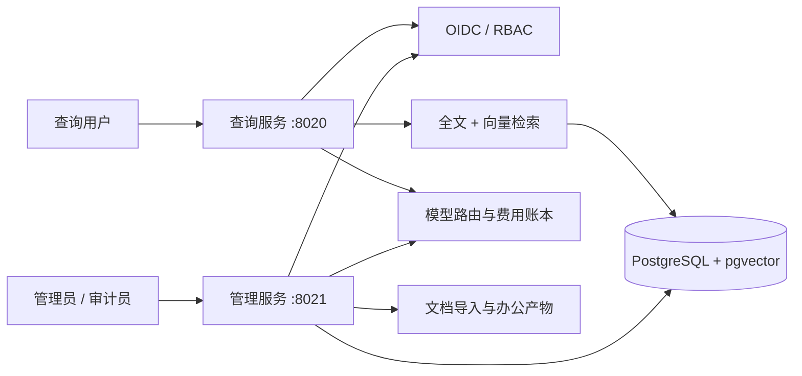

# DocMind IT Assistant

[](https://github.com/j77156057-art/docmind-it-assistant/actions/workflows/tests.yml)
[](https://www.python.org/)
[](LICENSE)

面向企业 IT 知识服务的安全型 RAG 应用。项目将只读查询服务与管理服务拆分，覆盖文档导入、混合检索、OIDC SSO、RBAC、检索前文档 ACL、审计、模型路由和办公文档生成。

> 这是可本地运行的工程化演示，不宣称已经完成生产部署。生产环境仍需要真实身份提供商、托管 PostgreSQL、对象存储、异步任务和基础设施安全策略。

## 界面预览

| 查询工作台 | 管理控制台 |
|---|---|
|  |  |

## 核心能力

- **服务隔离**：查询进程不注册上传、ACL 写入或办公产物生成接口。
- **企业身份**：OIDC Bearer Token 校验签名、`iss`、`aud`、`exp`、`iat` 与算法白名单。
- **最小权限**：`viewer < auditor < admin` 角色继承，查询历史与费用按匿名化主体隔离。
- **文档 ACL**：用户、组和角色条件直接进入召回查询，未授权内容不会先召回再过滤。
- **混合检索**：全文 BM25 与向量余弦召回通过 RRF 融合，Embedding 故障时降级到全文检索。
- **动态模型路由**：知识库、本地模型和云模型可在管理后台切换，无需重启查询服务。
- **可追踪成本**：记录模型每次尝试的 Token、延迟、供应商请求 ID、单价快照和费用。
- **结构化产物**：管理端生成并验证 DOCX、PDF、PPTX、XLSX，不执行任意脚本。
- **知识治理**：导入不再等于发布，版本有状态机、审批职责分离、作废与回滚，全程留痕。
- **异步索引**：导入可排队（返回 `202` + 任务号），Worker 抢占执行、心跳保活、失败按可重试性分类重试。
- **断点续跑编排**：可选的 LangGraph 引擎按批次 checkpoint，Worker 中途被杀不会重复为已完成的向量化付费。
- **发布前评测门**：黄金题集复用生产检索路径量化 recall@k、引用命中率与拒答正确率，`block` 模式可阻断未达标发布，越权放行必须留痕。
- **隐私日志**：日志不记录问题正文、回答正文、查询参数、会话 ID、客户端地址或密钥。

## 架构



查询和管理服务共享身份规则与数据模型，但拥有不同的 HTTP 暴露面。生产部署应进一步使用独立入口、数据库角色、网络策略和管理端写入挂载。

## 快速启动

环境要求：Windows PowerShell、Python 3.11 或更高版本。推荐 Python 3.13。

```powershell
git clone https://github.com/j77156057-art/docmind-it-assistant.git
cd docmind-it-assistant
.\scripts\dev.ps1 start -Open
```

脚本会创建项目虚拟环境、安装依赖、复制示例配置、使用项目内 SQLite、执行迁移，并在后台启动：

- 查询工作台：`http://127.0.0.1:8020/`
- 管理控制台：`http://127.0.0.1:8021/`
- 索引 Worker：无端口，随脚本一起启停（`status` 会显示 `running/stopped`）

脚本会强制 `IT_INGESTION_WORKER_ENABLED=true`（进程环境优先于 `.env`），因为 Worker 已经启动：导入会返回 `202` 并入队，由 Worker 完成解析与向量化。管理端"导入任务"视图可以看到队列与重试。

```powershell
.\scripts\dev.ps1 status
.\scripts\dev.ps1 stop
```

默认 `development` 认证会授予本机演示用户全部角色，并且配置层强制查询和管理地址均为回环地址。不要把开发认证用于共享网络或生产环境。

需要真实登录页的本机或面试演示环境可启用 `local` 模式：

```powershell
.venv\Scripts\python -c "from backend.auth import hash_password; print(hash_password('请替换为强密码'))"
```

将输出写入 `.env` 的 `IT_LOCAL_PASSWORD_HASH`，并设置 `IT_AUTH_MODE=local`、`IT_LOCAL_USERNAME=admin` 后重启。查询端和管理端都会在未登录时跳转到 `/login`，成功登录后使用 HttpOnly、SameSite=Strict 的限时会话 Cookie。公开部署仍应使用企业 OIDC，由身份平台完成 MFA、离职禁用和用户生命周期管理。

本地登录模式可设置 `IT_GUEST_LOGIN_ENABLED=true` 开启游客入口。每次游客登录都会生成独立的短期身份，只有 `viewer` 接口权限；ACL 检索会主动移除游客的角色和用户组上下文，因此只能查询 `public` 文档，不能访问受限文档、管理后台或其他游客的查询历史。`IT_GUEST_SESSION_HOURS` 控制游客会话有效期，默认 2 小时。

## Docker 本地环境

Docker Compose 会启动 PostgreSQL/pgvector、迁移任务、查询服务、管理服务和索引 Worker，宿主机端口仍只绑定 `127.0.0.1`：

```powershell
docker compose up -d --build
docker compose ps
docker compose down
```

Worker 与管理服务共享 `docmind_sources` 卷（否则 Worker 读不到上传的原文件，会以 `source_missing` 失败），
并把 checkpoint 放在独立的 `docmind_worker` 卷上，容器重建后仍可断点续跑。管理服务在该编排里固定
`IT_INGESTION_WORKER_ENABLED=true`：**启用异步导入就必须同时运行 Worker**，否则任务只会排队，
`/health/ready` 的 `ingestion.stalled` 会一直为真。Worker 刻意不配 healthcheck——它没有 HTTP 端点，
而"队列不消费"是诊断信息，重启容器解决不了。

该 Compose 文件用于本地演示，使用开发认证和示例数据库密码，不是生产部署清单。

## SSO、RBAC 与 ACL

生产配置必须满足：

```dotenv
IT_ENVIRONMENT=production
IT_AUTH_MODE=oidc
IT_DATABASE_URL=postgresql+psycopg://...
IT_EMBEDDING_MODE=provider
IT_OIDC_ISSUER=https://id.example.com/
IT_OIDC_AUDIENCE=docmind
IT_OIDC_JWKS_URL=https://id.example.com/.well-known/jwks.json
IT_AUTH_SUBJECT_SALT=<至少 32 字符的随机值>
```

生产模式会拒绝 SQLite、开发认证、`trusted_headers` 和本地 Hash Embedding。原始 OIDC `sub` 不入库，而是通过带密钥 HMAC 生成稳定主体标识。

管理端主要接口：

| 方法 | 路径 | 最低角色 | 用途 |
|---|---|---|---|
| `GET` | `/api/admin/documents` | auditor | 查看文档版本、访问范围与原文件状态 |
| `GET` | `/api/admin/documents/{id}/versions/{version}/source` | auditor | 在线查看或下载原文件 |
| `GET/PUT` | `/api/admin/documents/{id}/acl` | auditor/admin | 查看或替换文档 ACL |
| `POST` | `/api/admin/documents/import` | admin | 导入 Markdown、TXT、PDF、DOCX |
| `GET/POST` | `/api/admin/artifacts` | auditor/admin | 查看或生成办公产物 |
| `GET/PUT` | `/api/admin/model-config` | auditor/admin | 查看或切换运行时模型与回答策略 |
| `GET` | `/api/admin/audit-events` | auditor | 查看管理审计记录 |
| `GET` | `/api/admin/governance/pending` | `document.review` | 查看待审核版本 |
| `GET` | `/api/admin/documents/{id}/versions/{v}/preview` | `document.review` | 审核预览该版本的内容块（每次读取写审计） |
| `POST` | `/api/admin/documents/{id}/versions/{v}/review` | `document.review` | 通过或驳回（驳回必须填写意见） |
| `POST` | `/api/admin/documents/{id}/versions/{v}/publish` | `document.publish` | 发布已通过审核的版本 |
| `POST` | `/api/admin/documents/{id}/versions/{v}/withdraw` | `document.withdraw` | 作废当前已发布版本（必须填写原因） |
| `POST` | `/api/admin/documents/{id}/versions/{v}/rollback` | `document.rollback` | 回滚到历史版本（必须填写原因） |
| `GET` | `/api/admin/documents/{id}/versions/{v}/reviews` | `document.read` | 查看该版本的审批记录 |
| `GET` | `/api/admin/ingestion/jobs` | `document.read` | 查看索引任务与队列统计 |
| `POST` | `/api/admin/ingestion/jobs/{id}/retry` | `document.write` | 重新排队失败或已取消的任务 |
| `POST` | `/api/admin/ingestion/jobs/{id}/cancel` | `document.write` | 取消尚未开始的任务 |
| `GET` | `/api/admin/evaluation/cases` | `document.read` | 查看黄金题与门禁阈值 |
| `PUT` | `/api/admin/evaluation/cases` | `evaluation.run` | 新增或更新黄金题（按 `case_key` 覆盖） |
| `DELETE` | `/api/admin/evaluation/cases/{id}` | `evaluation.run` | 删除从未被评测引用的用例（有历史则 409） |
| `POST` | `/api/admin/evaluation/runs` | `evaluation.run` | 立即运行评测（`manual` / `pre_publish`） |
| `GET` | `/api/admin/evaluation/runs` | `document.read` | 查看评测运行与门禁结论 |
| `GET` | `/api/admin/evaluation/runs/{id}` | `document.read` | 查看逐题结果 |

## 知识治理：从"导入即发布"到审批发布

角色分两层：等级角色 `viewer < auditor < admin` 决定后台读取与配置权限；治理角色按**能力**授权，与等级正交，因此可以强制职责分离。

| 角色 | 能力 |
|---|---|
| `knowledge_editor` | `document.write`（上传、发起变更） |
| `knowledge_reviewer` | `document.review`、`evaluation.run` |
| `knowledge_publisher` | `document.publish`、`document.withdraw`、`document.rollback` |

`admin` 拥有导入与 ACL/模型配置能力，但**不自动拥有审核与发布能力**：单人环境需显式设置 `IT_GOVERNANCE_ALLOW_ADMIN_OVERRIDE=true`，并在操作时勾选越权开关，动作会记录 `is_override` 标记。

版本状态机：

```text
queued → processing → staged → indexed → superseded
                                   ↘ withdrawn
              staged → rejected
              superseded / withdrawn → indexed（回滚，不重新向量化）
```

只有 `indexed` 参与召回。`staged`、`rejected`、`withdrawn` 的分块虽然已入库，但混合检索、全文检索和知识大纲**都取不到**——这是本模块最重要的一条安全不变量，由 `tests/test_knowledge_governance.py` 直接断言。

```dotenv
IT_GOVERNANCE_MODE=review
IT_GOVERNANCE_REQUIRE_SEPARATION_OF_DUTIES=true
IT_GOVERNANCE_ALLOW_ADMIN_OVERRIDE=false
IT_LOCAL_ROLES=admin,auditor,viewer
```

`IT_GOVERNANCE_MODE` 默认 `direct`（保持历史行为：索引完成即发布）；生产建议 `review`。治理角色与本地登录可授予的角色都受白名单约束：写进 OIDC claim 或 `IT_LOCAL_ROLES` 但不在白名单内的角色会被丢弃，不会生效。

导入接口不能修改已存在文档的 `access_scope`：越权修改会被拒绝，访问范围只能通过 ACL 接口调整（需要 `acl.write` 并写审计）。审批动作全部记录在 `document_version_reviews`（只插入、不更新），与安全审计 `audit_events` 各司其职。

治理角色都带 `document.read`：审核者必须能看到被审版本的内容，因此治理角色的**文档库读取范围等同于审计员**（含受限文档），但不会因此获得 ACL 写入、模型配置或导入权限。若企业要求"按知识域隔离审核范围"（例如只允许审核本部门文档），需要先引入知识域模型，那是后续域 B 的工作。

## 异步索引 Worker

默认是同步导入（`IT_INGESTION_WORKER_ENABLED=false`），行为与历史版本一致。开启后，导入端点在校验并落盘后立即返回 `202` 与 `job_id`，解析、分块和向量化交给 Worker：

```dotenv
IT_INGESTION_WORKER_ENABLED=true
IT_INGESTION_WORKER_ID=
IT_INGESTION_POLL_SECONDS=2
IT_INGESTION_MAX_ATTEMPTS=3
IT_INGESTION_JOB_TIMEOUT_SECONDS=600
IT_INGESTION_HEARTBEAT_SECONDS=30
```

```powershell
.venv\Scripts\python -m worker
.venv\Scripts\python -m worker --once --max-jobs 50
```

- **任务表是业务队列，不是框架内部状态**：`ingestion_jobs` 一个 `(job_type, version_id)` 一行，管理端能看、能重试、能取消，审计不依赖任何编排框架的 checkpoint 格式。
- **抢占**：PostgreSQL 用 `FOR UPDATE SKIP LOCKED`，多副本 Worker 不会重复处理；SQLite 没有该子句，用条件更新兜底（开发/测试单实例）。
- **心跳与回收**：Worker 在每个步骤后写心跳；超过 `IT_INGESTION_JOB_TIMEOUT_SECONDS` 未心跳的任务被回收重排，尝试次数用尽则判为失败。`IT_INGESTION_HEARTBEAT_SECONDS` 必须小于任务超时，配置层会拒绝非法组合。
- **失败分类**：`embedding_timeout`、`embedding_unavailable`、HTTP 429/5xx 属可重试，自动重排；解析失败、配置错误、文件缺失属确定性失败，立即终止并写入 `last_error_code`。重试次数用尽后由管理员在任务视图人工决定是否重试。
- **隐私**：任务表只存业务元数据（版本、发起人、请求号），不存文档正文。
- **可观测**：`/health/ready` 返回 `ingestion` 诊断块（`stalled`、`queued`、`running`、`failed`）。它**刻意不放进 `checks`**：队列停滞意味着"没有 Worker 在消费"，重启 Pod 解决不了，因此不应让就绪探针失败。
- **Worker 与治理模式共用配置**：`direct` 模式下索引完成即发布，`review` 模式下停在 `staged` 等审批。

### 断点续跑引擎（可选）

默认引擎 `simple` 是纯 Python 顺序执行，不需要框架依赖。切换到 `langgraph` 后，解析→分批向量化→落库→定稿被编排成带 checkpoint 的图，**每批向量化后都会落检查点**，因此 Worker 在批次中途被杀时，恢复运行只处理剩余批次：

```powershell
python -m pip install -r requirements.txt -r requirements-worker.txt
.venv\Scripts\python -m worker --engine langgraph
```

```dotenv
IT_INGESTION_ENGINE=langgraph
IT_INGESTION_CHECKPOINT_PATH=data/worker-checkpoints.db
```

工程约束（由 `docs/isolation-boundary.md` §2.1 与自动测试共同保证）：

- **只进 Worker**：查询进程的 import 闭包内不得出现 `langgraph`/`langchain_core`/`langsmith`，由 `tests/test_isolation_boundary.py` 从 `app.py` 出发递归验证（我实测过：在 `backend/` 里插一行 `import langgraph` 会让测试立刻变红并打印命中路径）。
- **依赖可选**：LangGraph 及其 32 个传递依赖在 `requirements-worker.txt` / `requirements-worker-lock.txt`；查询与管理部署仍只装 39 个包的 `requirements.txt`，核心依赖集合**零变化**。
- **业务状态仍归本项目**：任务可见性、重试与审计读 `ingestion_jobs` 与 `document_versions`；框架 checkpoint 只存续跑所需的内部状态，任何服务都不读它。
- **checkpoint 不写应用 schema**：默认独立 SQLite 文件；PostgreSQL 下写入独立 schema。否则 `alembic check` 会报出未知表、迁移历史失真——`tests/test_indexing_graph.py` 里有一条测试专门跑完图之后验证 `alembic check` 仍然干净。
- **LangSmith 默认关闭**：代码不设置任何 `LANGSMITH_TRACING` / `LANGCHAIN_TRACING`（有测试禁止），启用只能是运维的显式动作，且需先完成脱敏评审。

容器镜像：仓库自带的 `Dockerfile` 只安装 `requirements.txt`，因此镜像里可以直接跑
`python -m worker --engine simple`；要用 `langgraph` 引擎需要在该镜像上补装 Worker 附加依赖：

```dockerfile
COPY requirements-worker.txt ./
RUN python -m pip install --no-cache-dir -r requirements-worker.txt
```

## 评测门与黄金题

"发布"不应只靠人工直觉。黄金题集让每次发布前都有可量化结论：

```dotenv
IT_EVAL_GATE_MODE=warn          # off | warn | block
IT_EVAL_ALLOW_OVERRIDE=false
IT_EVAL_MIN_RECALL=0.8
IT_EVAL_MIN_CITATION_ACCURACY=0.9
IT_EVAL_MAX_REGRESSION=0.05
IT_EVAL_TOP_K=5
```

**最重要的一条设计约束：评测复用生产检索路径。** 执行器调用的是 `HybridRetriever.retrieve`
（同一套嵌入、ACL 组装、混合检索与降级），而不是另写一份 SQL。否则指标描述的是"没人用的系统"，
这是评测体系最常见的失败方式——`tests/test_evaluation_gate.py` 里有一条测试直接统计
`hybrid_search` 的调用次数来钉住这一点。

指标定义（都是"应答题"为分母，因此 `citation_accuracy ≤ recall_at_k` 恒成立）：

| 指标 | 定义 |
|---|---|
| `recall@k` | 命中期望文档的题数 ÷ 需要命中的题数 |
| `citation_accuracy` | 命中且章节定位正确的题数 ÷ 需要命中的题数 |
| `refusal_accuracy` | 正确拒答的题数 ÷ 应拒答题数 |

门禁行为：

- `off`：不执行发布前评测，`gate_result` 记为 `NULL`——"没评测"与"评测通过"永不混淆。
- `warn`：照常发布，但记录结论与原因。
- `block`：指标不达标（或相对基线回退超过 `IT_EVAL_MAX_REGRESSION`）时**阻断发布**，返回 `409`。
- 黄金题为空时只告警不阻断：否则第一天谁都无法发布；但它在界面上是明确的"未判定"，不是静默通过。

**越权放行需要三件事同时成立**：请求显式带 `override: true`、`IT_EVAL_ALLOW_OVERRIDE=true`、
且主体同时持有 `document.publish` 与 `governance.override`。只持有发布权不能绕过质量门禁——
这正是把"能发布"和"能无视度量"分开的原因。放行会写入一条 `override_gate` 审批记录（`is_override=true`）。

评测的身份是固定的（`system:evaluation` + `viewer` 角色），因此结论不取决于谁点了按钮。
代价是：**黄金题只能引用 viewer 可见的文档**；受限文档若要在评测中命中，需要给它加上
`role:viewer`（或等待后续的"知识域"模型，见域 B）。

## 模型与密钥

回答策略可在管理后台选择：`knowledge_first`（默认，命中后直接返回知识库）、`generative_first`（先按 ACL 检索，再交给模型组织客服回答）或 `hybrid`（简单问题直接返回，复杂问题生成式回答）。生成式提示词只包含当前用户可见的检索片段，并保留来源引用；模型不可用时会降级为确定性知识答案或安全拒答。知识证据不足时，可路由到 Ollama、llama.cpp 或 OpenAI 兼容云供应商。云端密钥可以来自进程环境、未提交的 `.env`，或管理后台加密保存的运行时凭据；接口响应、页面与审计日志不会回显明文。

云端模式可直接在“系统状态 → 模型配置”填写供应商、模型和 API Key。系统会先发起一次真实的短请求验证连接，再把密钥用 `IT_AUTH_SUBJECT_SALT` 派生的密钥加密保存；页面和接口只返回“已配置”，不会回显明文。切勿随意更换 `IT_AUTH_SUBJECT_SALT`，否则已保存密钥将无法解密；生产环境更推荐将密钥放入部署平台的 Secret Manager 或环境变量。

管理后台切换到本地模型时，会先执行一次真实的短请求：Ollama 会调用 `/api/generate` 将目标模型加载并确认它出现在 `/api/ps`；llama.cpp 会调用兼容的 `/chat/completions`。探活失败不会保存新配置，系统状态页会显示“服务不可达 / 模型未安装 / 尚未启动 / 已启动”。Ollama 可用 `ollama serve` 启动服务，llama.cpp 需先运行自己的 `llama-server`（默认 `127.0.0.1:8080`）。

注意：Ollama 和 llama.cpp 是两种不同的本地供应商。即使模型文件名称相近，Ollama 中的模型（例如 `qwen3.6:35b-a3b`）也不会让 `llama.cpp / qwen3.6-35b-a3b` 自动变为可用；必须在后台把供应商切换为“本地 Ollama”。

管理后台导入的原文件会按 `data/sources/<document-id>/v<version>-<filename>` 保存，文档详情可以直接查看或下载。历史上只保留索引、未保存原件的版本会明确显示“该历史版本未保留原文件”。

```dotenv
IT_MODEL_MODE=knowledge
IT_LOCAL_PROVIDER=ollama
IT_LOCAL_MODEL=qwen2.5:7b
IT_CLOUD_PROVIDER=qwen
IT_CLOUD_MODEL=qwen-plus
```

供应商配置和全部环境变量见 [.env.example](.env.example)。

## 数据库与迁移

```powershell
.venv\Scripts\python -m alembic upgrade head
.venv\Scripts\python -m alembic current
```

迁移可升级、可降级；涉及数据删除的降级必须先备份。细节见 [migrations/README.md](migrations/README.md)。

### PostgreSQL 必须安装 pgvector

迁移 `20260920_0003_documents_hybrid_search` 在 PostgreSQL 上执行 `CREATE EXTENSION IF NOT EXISTS vector`（SQLite 路径不执行），向量列与 HNSW 余弦索引都依赖它。数据库服务端**没有** pgvector 时，`alembic upgrade head` 会在这一步直接失败：

```
sqlalchemy.exc.NotSupportedError: (psycopg.errors.FeatureNotSupported) extension "vector" is not available
DETAIL:  Could not open extension control file "/usr/share/postgresql/16/extension/vector.control": No such file or directory
```

两条安装路径，选一条即可：

| 部署方式 | 做法 |
|---|---|
| 容器 | 用官方镜像 `pgvector/pgvector:pg16` 或 `:pg17` 代替 `postgres`（本仓库 `compose.yaml` 用的是 `pgvector/pgvector:pg17`）。**不要**把镜像换回裸 `postgres`。 |
| 自建实例 | 先装发行版扩展包：Debian/Ubuntu `postgresql-16-pgvector`，RHEL 系 `pgvector_16`，或从源码编译。然后在目标库执行 `CREATE EXTENSION vector`。 |

`CREATE EXTENSION` 需要相应权限，而应用角色通常不是超级用户，**建议由 DBA 预先在目标库建好扩展**，再让应用跑迁移。

> 注意区分：Python 包 `pgvector.sqlalchemy`（已随 `requirements.txt` 安装，让 SQLAlchemy 能表达向量类型）与服务端扩展是两件不同的事——只有后者提供 `vector` 类型、距离运算与 HNSW 索引。

## 测试与安全检查

```powershell
.venv\Scripts\python -B -m unittest discover -s tests -v
node --check web/admin.js
.venv\Scripts\python -m pip check
```

测试覆盖查询/管理隔离、OIDC、RBAC、主体数据隔离、文档 ACL、上传边界、路径约束、迁移升降级、混合检索、模型重试、费用账本、日志隐私、知识治理的状态机与召回隔离、索引队列的抢占/心跳回收/重试分类/202 异步导入、导入闭包边界与 LangGraph checkpoint 断点续跑，以及评测门的指标计算、生产检索路径复用、`block` 阻断、越权留痕与基线回归。GitHub Actions 还会执行锁定依赖漏洞扫描（核心与 Worker 两份锁文件）。

安全问题请参阅 [SECURITY.md](SECURITY.md)，不要在公开 Issue 中提交密钥或企业数据。

## 当前限制

- 异步 Worker 目前只实现 `import` 任务类型：`reindex` / `withdraw` / `evaluate` 会在任务表里显式失败（`job_type_unsupported`），不会静默跳过。
- 可重试失败的重排没有持久化退避时间（`next_attempt_at`）；当前退避只在 Worker 进程内生效。
- LangGraph 的 PostgreSQL checkpoint 路径由 `tests/test_indexing_graph_postgres.py` 覆盖：CI 拉起 `pgvector/pgvector` 服务（与 `compose.yaml` 同镜像家族，迁移 0003 需要 `vector` 扩展），断言独立 schema 建表、续跑不重复计费、以及 checkpoint 不进入应用 schema（`alembic` 看不到）。本机没有 PostgreSQL 时该模块自动跳过；SQLite 路径由 `tests/test_indexing_graph.py` 覆盖。
- 发布前评测在发布请求内**同步整跑**黄金题：题集很大时发布会变慢，`evaluate` 任务类型虽已声明但尚未实现异步评测。
- 办公产物保存在本地目录，尚未接入对象存储、保留策略和审批发布。
- Web 前端尚未实现 OIDC Authorization Code + PKCE 登录，当前生产入口面向 Bearer Token 客户端或身份网关。
- 尚无检索重排（后续批次）。
- 尚未在本仓库中提供 Kubernetes、云网络策略、备份恢复和可观测性部署清单。
- 外部模型与真实身份提供商需要部署方自行配置和联调。

## 项目文档

- [项目状态](PROJECT_STATUS.md)
- [企业架构](docs/enterprise-architecture.md)
- [业务结构蓝图](docs/business-structure-blueprint.md)（v1 评审稿）
- [知识治理数据模型](docs/knowledge-governance-data-model.md)（v1 评审稿）
- [隔离边界](docs/isolation-boundary.md)
- [文档导入与检索](docs/document-ingestion.md)
- [实施路线图](docs/implementation-roadmap.md)

## License

[MIT](LICENSE)
