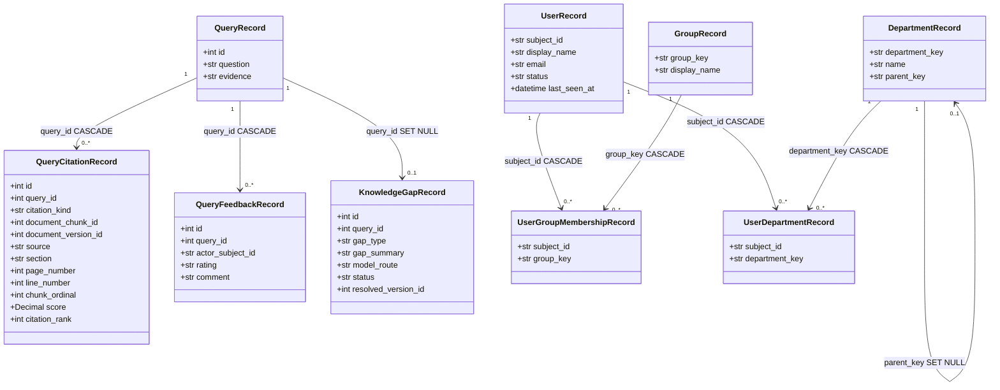
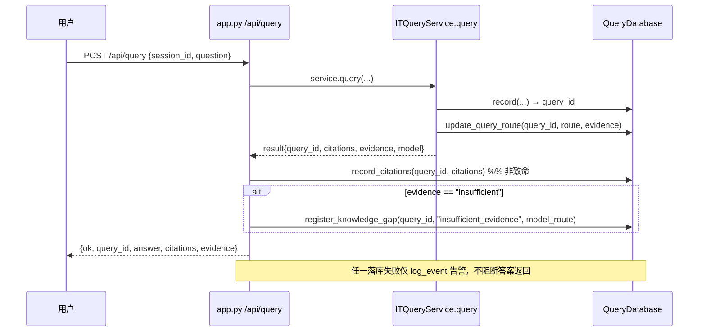
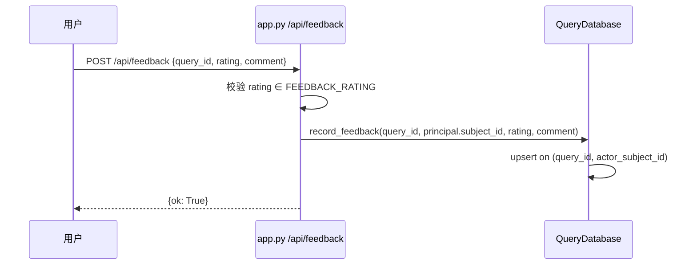
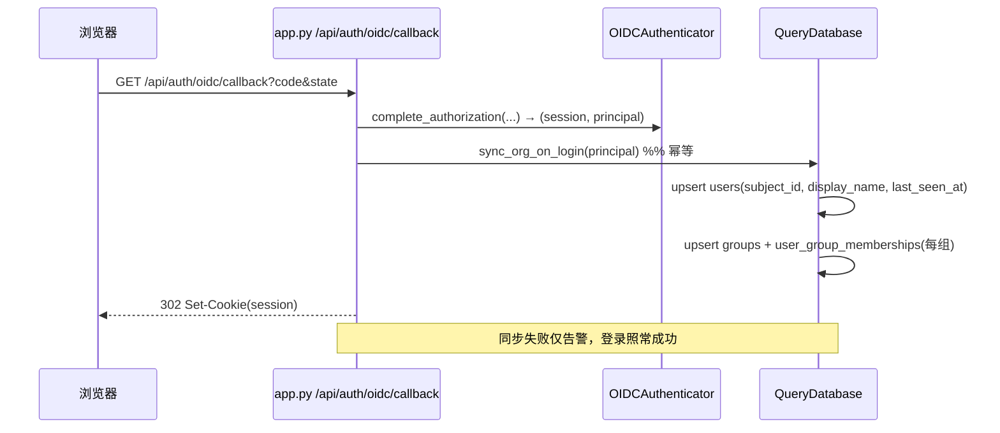

# 架构设计 + 任务分解：DocMind「采购硬缺口」增量需求

> 作者：架构师 高见远（Gao） ｜ 对应 PRD：`docs/prd-procurement-gaps.md`
> 范围：P0 必做 + 部分 P1（见 §7 决策）；P2 不在本轮。
> 约束：不切换 ACL 写入/执行路径；缺口表不复制明文问题；组织模型最小范围（仅 HMAC `subject_id`、部门纯元数据）。

---

## 1. 实现方案概述 + 框架/库选型

### 1.1 技术难点

1. **三类信号首次落库**：引用（从未持久化）、反馈、知识缺口，需在不改动现有查询热路径的前提下，于回答返回边界安全落地。
2. **FK 级联语义差异**：`query_citations` 须随 `queries` 级联清理；`knowledge_gaps` 须保留（源 query 删除后 `SET NULL`），且**绝不**明文复制 `query.question`（已受 `query_field_key` Fernet 保护）。
3. **组织表与既有 ACL 同构零迁移**：`users.subject_id` = `document_acl.principal_id`（user 型）HMAC 哈希；`groups.group_key` = `document_acl.principal_id`（group 型）声明字符串。本轮仅登录懒同步 + 只读展现，热路径（召回 SQL 字符串比对）不动。
4. **方言兼容**：SQLite 本地跑 pytest，PostgreSQL（pgvector）仅在 CI。新表迁移须双方言校验通过；SQLite 不自动触发 `ON DELETE CASCADE`，须遵循既有项目约定（显式清理或仅依赖 PG 行为）。

### 1.2 框架/库选型

| 维度 | 选型 | 说明 |
|---|---|---|
| Web 框架 | **FastAPI**（既有） | 管理端 `admin_app.py`、查询端 `app.py` 沿用同一 `require_capability` / `Depends` 范式。无需新增。 |
| ORM | **SQLAlchemy 2.0 `Mapped`/`mapped_column`**（既有） | 新表继承同一 `Base`，沿用 `QueryRecord` 风格。无需新增。 |
| 迁移 | **Alembic**（既有） | 单条迁移 `create_table` 全部新表，`down_revision=20260922_0012`。无需新增。 |
| 加密 | **cryptography / Fernet**（既有 `FieldEncryptor`） | 仅用于字段加密；缺口表**不**调用它（不复制明文）。无需新增。 |
| 向量 | pgvector（既有，仅 `EmbeddingVector`） | 新表不含向量列，不引入新依赖。 |
| CSV 导出 | **标准库 `csv` + `io`**（既有 `audit-events/export` 已用） | 沿用 `utf-8-sig` BOM 约定。无需新增。 |

**新增依赖：无。** 全部复用现有栈，避免引入重依赖。

### 1.3 架构分层

```
[app.py /api/query] ──调用──> [assistant/service.py ITQueryService.query] ──> [database.record/update_query_route]
        │ 返回 result{query_id,citations,evidence,model}
        └─(T4 接线)──> database.record_citations() / register_knowledge_gap()   [非致命，失败仅告警]
[app.py /api/feedback] ──> database.record_feedback()                          [幂等 upsert]
[app.py /api/auth/oidc/callback] ──> database.sync_org_on_login(principal)      [T5 登录懒同步]
[admin_app.py /api/admin/*] ──> database.<list/export>() + record_audit_event() [T6 只读展现 + 自审计]
```

设计原则：**写入接线放在 HTTP 边界（app.py），DB 层只暴露原子方法**；落库失败不阻断用户答案（非致命 + 日志告警），与现有 `record_model_attempts` 失败不阻断回答的思路一致。

---

## 2. 文件列表（新建 + 修改，相对路径）

| 文件 | 类型 | 职责 |
|---|---|---|
| `backend/db_models.py` | **修改** | 新增 8 张表模型（`QueryCitationRecord`、`QueryFeedbackRecord`、`KnowledgeGapRecord`、`UserRecord`、`GroupRecord`、`UserGroupMembershipRecord`、`DepartmentRecord`、`UserDepartmentRecord`）+ 词汇常量（`FEEDBACK_RATING`、`GAP_TYPES`、`GAP_STATUS`）。沿用 `Base` 与 `Mapped` 风格。 |
| `migrations/versions/20260922_0013_procurement_gaps.py` | **新建** | 单条迁移：`create_table` 全部新表（含 FK、`ondelete`、CHECK、唯一约束）；`down_revision="20260922_0012"`。 |
| `backend/database.py` | **修改** | 在 `QueryDatabase` 新增落库/查询/组织同步方法；更新 `initialize()`（SQLite `create_all` 自动纳入新表）、`healthcheck()` 的 `required` 集合、`backend` 引用。沿用 `with self._sessions.begin()` 写、`with self._sessions()` 读。 |
| `app.py` | **修改** | T4：在 `/api/query` 返回后调用 `record_citations` / `register_knowledge_gap`（非致命）；新增 `/api/feedback` 端点（鉴权 `viewer`）。T5：在 `/api/auth/oidc/callback` 登录成功后调用 `sync_org_on_login(principal)`。 |
| `admin_app.py` | **修改** | T6：新增各新表 GET 列表 + 导出端点（`audit.read` 鉴权 + 自审计）；P1-2 缺口 `resolve`/`dismiss`（`document.write`）；P1-3 组织导出端点。复用 `require_capability` 与 `audit-events/export` 的 CSV 模板。 |
| `tests/test_procurement_gaps.py` | **新建** | T7：覆盖 DB 方法（citations 级联、feedback 幂等、gap SET NULL、org 同步 upsert）+ 管理端点（鉴权 403、导出 header/行、自审计、CSV BOM）+ 本地 SQLite 全量；PG 用例按既有约定 `@pytest.mark.skipif` 跳过。 |
| `docs/architecture-procurement-gaps.md` | **新建** | 本文档。 |
| `README.md` / `docs/` 相关迁移说明 | **修改**（可选） | T8：同步变更说明（新表、新端点、登录同步语义）。 |

---

## 3. 新增表数据结构

### 3.1 词汇常量（`backend/db_models.py`）

```python
FEEDBACK_RATING = ("positive", "negative")
GAP_TYPES = ("insufficient_evidence",)          # "low_confidence" 预留给 P1-1，本轮不进 CHECK
GAP_STATUS = ("open", "addressed", "dismissed")
ORG_STATUS = ("active", "inactive")             # 仅 users.status 使用
```

### 3.2 表字段（PK / FK / `ondelete`）

**`query_citations`**（引用持久化）
| 字段 | 类型 | 约束 | 说明 |
|---|---|---|---|
| `id` | Integer | PK, autoincrement | — |
| `query_id` | Integer | FK `queries.id` **ON DELETE CASCADE**, index | 随 query 级联；PG 生效，SQLite 遵循项目既有"显式清理"约定 |
| `citation_kind` | String(16) | CHECK `IN ('chunk','knowledge')` | 区分两类引用形态 |
| `document_chunk_id` | Integer | FK `document_chunks.id` **ON DELETE SET NULL**, nullable | chunk 型解析后填充，知识库型为 NULL |
| `document_version_id` | Integer | FK `document_versions.id` **ON DELETE SET NULL**, nullable | 冗余统计列 |
| `source` | String(512) | nullable=False | 文档标题 或 `"knowledge.md"` |
| `section` | String(512) | nullable=False, default="" | chunk 型=heading；知识库型=章节标题 |
| `page_number` | Integer | nullable | chunk 型页码 |
| `line_number` | Integer | nullable | 知识库型行号（扩列以对齐两种形态） |
| `chunk_ordinal` | Integer | nullable | chunk 型原始 ordinal（解析 FK 用） |
| `score` | Numeric(10,6) | nullable | 检索得分 |
| `citation_rank` | Integer | nullable=False, default=0 | 在答案中的顺序 |
| `created_at` | DateTime(tz) | nullable=False, default=utcnow | — |

**`query_feedback`**（用户反馈）
| 字段 | 类型 | 约束 | 说明 |
|---|---|---|---|
| `id` | Integer | PK | — |
| `query_id` | Integer | FK `queries.id` **ON DELETE CASCADE**, index | 随 query 级联 |
| `actor_subject_id` | String(64) | nullable=False, index | HMAC 哈希，与 `queries.owner_subject_id` 同构 |
| `rating` | String(16) | CHECK `IN FEEDBACK_RATING` | positive / negative |
| `comment` | String(1000) | nullable | ≤1000 字 |
| `created_at` | DateTime(tz) | default=utcnow | — |
| `updated_at` | DateTime(tz) | default=utcnow | 幂等更新时刷新 |
| — | — | **Unique(`query_id`,`actor_subject_id`)** | 同一 (query,user) 幂等 |

**`knowledge_gaps`**（知识缺口）
| 字段 | 类型 | 约束 | 说明 |
|---|---|---|---|
| `id` | Integer | PK | — |
| `query_id` | Integer | FK `queries.id` **ON DELETE SET NULL**, nullable, index | **弱引用**，源 query 删除后仍可读 |
| `gap_type` | String(32) | CHECK `IN GAP_TYPES` | 本轮仅 `insufficient_evidence` |
| `gap_summary` | String(1000) | nullable=False, default="" | **非 PII 模板**，绝不复制 `query.question` 明文 |
| `model_route` | String(32) | nullable=False | 触发时的模型路由 |
| `status` | String(16) | CHECK `IN GAP_STATUS`, default="open" | open/addressed/dismissed |
| `resolved_version_id` | Integer | FK `document_versions.id` **ON DELETE SET NULL**, nullable | 补录关联版本 |
| `created_at` / `updated_at` | DateTime(tz) | default=utcnow | — |

**`users`**（组织模型，最小范围）
| 字段 | 类型 | 约束 | 说明 |
|---|---|---|---|
| `subject_id` | String(64) | **PK** | HMAC 哈希，与 `document_acl.principal_id`(user) 同构、零迁移 |
| `display_name` | String(128) | nullable=False, default="" | 来自 OIDC `name`/`preferred_username` |
| `email` | String(256) | nullable | 非必填，OIDC `email` 声明 |
| `status` | String(16) | CHECK `IN ORG_STATUS`, default="active" | — |
| `last_seen_at` | DateTime(tz) | nullable | 登录懒同步时刷新 |
| `created_at` | DateTime(tz) | default=utcnow | — |

**`groups`**
| 字段 | 类型 | 约束 | 说明 |
|---|---|---|---|
| `group_key` | String(256) | **PK** | 声明字符串，与 `document_acl.principal_id`(group) 同构 |
| `display_name` | String(256) | nullable=False, default="" | 无 OIDC 展示名时回退为 `group_key` |
| `created_at` | DateTime(tz) | default=utcnow | — |

**`user_group_memberships`**
| 字段 | 类型 | 约束 | 说明 |
|---|---|---|---|
| `subject_id` | String(64) | FK `users.subject_id` **ON DELETE CASCADE** | — |
| `group_key` | String(256) | FK `groups.group_key` **ON DELETE CASCADE** | — |
| `created_at` | DateTime(tz) | default=utcnow | — |
| — | — | **PK(`subject_id`,`group_key`)** | — |

**`departments`**（纯元数据，不进 ACL）
| 字段 | 类型 | 约束 | 说明 |
|---|---|---|---|
| `department_key` | String(64) | **PK** | — |
| `name` | String(256) | nullable=False, default="" | — |
| `parent_key` | String(64) | FK `departments.department_key` **ON DELETE SET NULL**, nullable, use_alter | 自引用，允许孤儿 |
| `created_at` | DateTime(tz) | default=utcnow | — |

**`user_department`**（元数据级）
| 字段 | 类型 | 约束 | 说明 |
|---|---|---|---|
| `subject_id` | String(64) | FK `users.subject_id` **ON DELETE CASCADE** | — |
| `department_key` | String(64) | FK `departments.department_key` **ON DELETE CASCADE** | — |
| `created_at` | DateTime(tz) | default=utcnow | — |
| — | — | **PK(`subject_id`,`department_key`)** | — |

### 3.3 关系（Mermaid classDiagram）



---

## 4. 关键接口 / 类图

### 4.1 `QueryDatabase` 新增方法签名（`backend/database.py`）

| 方法 | 签名 | 职责 |
|---|---|---|
| 落库引用 | `record_citations(query_id: int, citations: list[dict]) -> None` | 遍历 citations，区分 chunk/knowledge；chunk 型按 `(title,version,ordinal)` best-effort 解析 `document_chunk_id`/`document_version_id`，失败则仅存去规范化字段；批量 `add_all`。**非致命**：调用方捕获异常仅告警。 |
| 落库反馈 | `record_feedback(query_id: int, actor_subject_id: str, rating: str, comment: str) -> None` | 按 `(query_id, actor_subject_id)` **幂等 upsert**（先 `session.get` 后更新/插入，沿用 `set_runtime_model_config` 范式）；`rating` 须 ∈ `FEEDBACK_RATING`，`comment` 截断 1000。 |
| 登记缺口 | `register_knowledge_gap(query_id: int, gap_type: str, model_route: str, gap_summary: str = "") -> int` | 插入 `status='open'`；`gap_summary` 默认非 PII 模板（如 `"自动登记：{gap_type}，路由 {model_route}"`），**绝不**含问题明文；返回新行 id。 |
| 解决缺口 | `resolve_knowledge_gap(gap_id: int, resolved_version_id: int, actor_subject_id: str, request_id: str) -> None` | 置 `status='addressed'` + `resolved_version_id`；自审计 `knowledge_gap.resolve`。 |
| 忽略缺口 | `dismiss_knowledge_gap(gap_id: int, actor_subject_id: str, request_id: str) -> None` | 置 `status='dismissed'`；自审计 `knowledge_gap.dismiss`。 |
| 引用列表 | `citations(query_id: int | None = None, start=None, end=None, limit: int = 200) -> list[dict]` | 只读，返回管理端字段。 |
| 反馈列表 | `feedback(rating: str | None = None, actor: str | None = None, limit: int = 200) -> list[dict]` | 只读，支持过滤。 |
| 缺口列表 | `knowledge_gaps(gap_type: str | None = None, status: str | None = None, limit: int = 200) -> list[dict]` | 只读，支持过滤。 |
| 组织用户 | `org_users(limit: int = 500) -> list[dict]` | 只读，含 `department_key`（富化占位，本轮不强制）。 |
| 组织组 | `org_groups(limit: int = 500) -> list[dict]` | 返回 `group_key, display_name, member_count`（聚合 `user_group_memberships`）。 |
| 组织部门 | `org_departments(limit: int = 500) -> list[dict]` | 只读元数据。 |
| 导出查询 | `citations_export / feedback_export / knowledge_gaps_export / org_users_export / org_groups_export / org_departments_export(...)` | 返回 `list[dict]`（与列表同字段），供端点拼 CSV/JSON。 |
| 登录同步 | `sync_org_on_login(principal: Principal) -> None` | **幂等 upsert**：`users`（`subject_id`/`display_name`/`last_seen_at=now`/`status='active'`）；对每个 `principal.groups` upsert `groups`（`display_name` 回退 `group_key`）+ `user_group_memberships`。写失败仅告警，不影响登录。 |

> 所有写方法沿用 `with self._sessions.begin() as session:`；读方法沿用 `with self._sessions() as session:`。返回一律 `dict`（与 `audit_events`/`history` 一致）。

### 4.2 管理端点签名（`admin_app.py`，复用 `require_capability` + `record_audit_event`）

| 端点 | Method | 鉴权 | 说明 |
|---|---|---|---|
| `/api/admin/citations` | GET | `audit.read` | 列表 |
| `/api/admin/citations/export` | GET | `audit.read` | csv\|json，过滤 `start/end/query_id`，自审计 `citations.export` |
| `/api/admin/feedback` | GET | `audit.read` | 列表 |
| `/api/admin/feedback/export` | GET | `audit.read` | csv\|json，过滤 `rating/actor`，自审计 `feedback.export` |
| `/api/admin/knowledge-gaps` | GET | `audit.read` | 列表 |
| `/api/admin/knowledge-gaps/export` | GET | `audit.read` | csv\|json，过滤 `gap_type/status`，自审计 `knowledge_gaps.export` |
| `/api/admin/knowledge-gaps/{id}/resolve` | POST | `document.write` | body `{resolved_version_id}`；自审计 `knowledge_gap.resolve` |
| `/api/admin/knowledge-gaps/{id}/dismiss` | POST | `document.write` | 自审计 `knowledge_gap.dismiss` |
| `/api/admin/org/users` | GET | `audit.read` | 列表 |
| `/api/admin/org/groups` | GET | `audit.read` | 列表（含 `member_count`） |
| `/api/admin/org/departments` | GET | `audit.read` | 列表 |
| `/api/admin/org/users/export` *(P1-3)* | GET | `audit.read` | csv\|json，自审计 `org_users.export` |
| `/api/admin/org/groups/export` *(P1-3)* | GET | `audit.read` | csv\|json，自审计 `org_groups.export` |
| `/api/admin/org/departments/export` *(P1-3)* | GET | `audit.read` | csv\|json，自审计 `org_departments.export` |

### 4.3 用户反馈端点（`app.py`）

| 端点 | Method | 鉴权 | 说明 |
|---|---|---|---|
| `/api/feedback` | POST | `viewer`（最小可读） | body `{query_id:int, rating:str, comment:str}` → `database.record_feedback`；不强制自审计（与 `/api/query` 同范式）。 |

---

## 5. 调用流程时序（Mermaid）

### ① `/api/query` 返回时落库 citations 与（insufficient 时）gaps



### ② 用户提交反馈



### ③ 登录时 org 懒同步



### ④ 管理员导出（以 citations 为例，其余同构）

```mermaid
sequenceDiagram
    participant Adm as 管理员
    participant E as admin_app /api/admin/citations/export
    participant D as QueryDatabase

    Adm->>E: GET .../citations/export?export_format=csv&start&end&query_id
    E->>E: require_capability("audit.read")
    E->>D: citations_export(start, end, query_id)
    D-->>E: list[dict]
    E->>E: 拼 CSV(utf-8-sig) 或 JSON
    E->>D: record_audit_event(action="citations.export", target_type="citations_export", ...)
    E-->>Adm: Response(attachment; filename=citations-export-*.csv)
```

---

## 6. 有序任务列表（按实现顺序，标注依赖与分批）

> 规则：T1→T2→T3 为底层数据链；T4/T5/T6 并行依赖 T3；T7 依赖 T4/T5/T6；T8 收尾。可分批：批次 A = T1+T2+T3；批次 B = T4+T5+T6；批次 C = T7+T8。

### T1 · 数据模型（建表）
- **文件**：`backend/db_models.py`
- **做什么**：新增 8 张表模型 + 常量 `FEEDBACK_RATING`/`GAP_TYPES`/`GAP_STATUS`/`ORG_STATUS`；严格遵守 §3 的 PK/FK/`ondelete`/CHECK/唯一约束与字段类型。
- **依赖**：无
- **优先级**：P0
- **验收**：`python -c "import backend.db_models"` 通过；新表均挂载同一 `Base`；`query_citations.query_id` CASCADE、`knowledge_gaps.query_id` SET NULL 在模型层声明正确。

### T2 · Alembic 迁移
- **文件**：`migrations/versions/20260922_0013_procurement_gaps.py`（新建）
- **做什么**：`op.create_table` 全部 8 表（含 FK、`ondelete`、CHECK、`UniqueConstraint`）；`departments.parent_key` 自引用用 `use_alter=True`；`down_revision="20260922_0012"`，`revision="20260922_0013"`；`downgrade()` 反向 `drop_table`。
- **依赖**：T1
- **优先级**：P0
- **验收**：`alembic upgrade head` 在 SQLite 生成全部表；`alembic downgrade -1` 干净回退；PG 方言经 CI 校验（本机跳过，注明"由 CI 验证"）。

### T3 · DB 层方法
- **文件**：`backend/database.py`（修改 `QueryDatabase`、更新 `healthcheck()` 的 `required` 集合）
- **做什么**：实现 §4.1 全部方法（`record_citations`/`record_feedback`/`register_knowledge_gap`/`resolve_knowledge_gap`/`dismiss_knowledge_gap`/各列表与导出查询/`sync_org_on_login`）。feedback 幂等 upsert 用"先 get 后更新/插入"范式；citations 解析 chunk FK 为 best-effort。
- **依赖**：T1
- **优先级**：P0
- **验收**：单测（SQLite）覆盖 citations 批量写入、feedback 重复提交只更新一行、gap 行 `query_id` 可为 NULL 且不抛错、`sync_org_on_login` 二次登录幂等、`healthcheck` 含新表。

### T4 · 写入接线（query + feedback 端点）
- **文件**：`app.py`（修改 `/api/query`；新增 `/api/feedback`）
- **做什么**：在 `result = service.query(...)` 之后非致命调用 `record_citations` 与（insufficient 时）`register_knowledge_gap`；新增 `/api/feedback` 端点（鉴权 `viewer`，参数校验，调用 `record_feedback`）。
- **依赖**：T3
- **优先级**：P0
- **验收**：`/api/query` 返回 200 且 citations 落库（可查 `query_citations`）；insufficient 场景生成 `knowledge_gaps` 行；feedback 重复提交幂等；落库异常不影响答案（注入故障验证仅告警）。

### T5 · 登录同步接线
- **文件**：`app.py`（修改 `/api/auth/oidc/callback`）
- **做什么**：在 `complete_authorization` 成功拿到 `principal` 后调用 `database.sync_org_on_login(principal)`（包 try/except，失败仅告警）。
- **依赖**：T3
- **优先级**：P0
- **验收**：OIDC 登录后 `users`/`user_group_memberships` 出现对应行；二次登录 `display_name`/`last_seen_at` 刷新但不重复建行；同步失败登录仍成功。

### T6 · 管理端点
- **文件**：`admin_app.py`（修改）
- **做什么**：实现 §4.2 全部 GET 列表 + 导出端点（`audit.read` + 自审计，复用 `audit-events/export` 的 CSV/JSON + `utf-8-sig` 模板）；**P1-2** `resolve`/`dismiss`（`document.write`）；**P1-3** 组织导出端点。
- **依赖**：T3
- **优先级**：P0（列表/导出）+ P1（resolve/dismiss/组织导出，见 §7）
- **验收**：审计员可列/导；viewer 访问 403；导出 CSV 首行 header 正确、含 BOM；每次导出产生 `*.export` 审计行；resolve/dismiss 改 `status` 并自审计；组织导出同构。

### T7 · 测试
- **文件**：`tests/test_procurement_gaps.py`（新建）
- **做什么**：覆盖 T3/T4/T5/T6 行为；端点鉴权 403、导出 header/行/自审计/CSV BOM；本地 SQLite 全量跑通；涉及 PG 专属行为（如真 CASCADE）按既有约定 `skipif` 跳过并注明"由 CI 验证"。
- **依赖**：T4、T5、T6
- **优先级**：P0
- **验收**：`.venv` 内 `pytest tests/test_procurement_gaps.py` 全绿；改动后本地跑**全量** `pytest` 通过。

### T8 · 文档同步
- **文件**：`docs/`（更新迁移说明/变更日志）、`README.md`（如有相关章节）
- **做什么**：记录新表、新端点、登录懒同步语义、缺口不复制明文约定；跑全量 `pytest` 最终确认。
- **依赖**：T7
- **优先级**：P0
- **验收**：文档与实现一致；全量 pytest 通过。

---

## 7. 依赖包列表

**无新增第三方依赖。** 全部复用既有栈：FastAPI、SQLAlchemy 2.0、Alembic、cryptography（Fernet）、pgvector（已存在，新表未使用）、标准库 `csv`/`io`。

---

## 8. 共享知识 / 跨文件约定

1. **命名约定**
   - 表名单数语义 + 下划线：`query_citations` / `query_feedback` / `knowledge_gaps` / `users` / `groups` / `user_group_memberships` / `departments` / `user_department`。
   - DB 方法：`record_*` 写、`*_export` 返回 `list[dict]` 供端点拼装、`org_*` 组织只读。
   - 审计动作：`<entity>.export`（如 `citations.export`）、`knowledge_gap.resolve` / `knowledge_gap.dismiss`；`target_type` 用 `<entity>_export` / `knowledge_gap`。

2. **审计动作命名规范**：对齐既有 `audit.export` 形态——写类运营操作（resolve/dismiss）与所有导出均须 `record_audit_event` 自审计；用户侧 `/api/feedback` 不强制（与 `/api/query` 同范式，避免噪声）。

3. **导出 CSV 头约定**：列名用 `lower_snake_case`，首列 `id`、末含 `created_at`（与 `audit-events/export` 一致）；统一 `utf-8-sig` BOM 便于 Excel 中文；`text/csv; charset=utf-8`；`Content-Disposition: attachment; filename=<entity>-export-<stamp>.<ext>`。

4. **写入非致命约定**：引用/缺口落库、登录 org 同步均不得阻断主流程——异常 `log_event(WARNING,...)` 后继续；与既有 `record_model_attempts` 失败不阻断回答一致。

5. **字段加密红线**：`query.question` 受 `query_field_key` Fernet 保护；**任何新表不得明文复制问题文本**。`knowledge_gaps.gap_summary` 只能是运营填的非 PII 模板/摘要。

6. **幂等范式**：feedback、org 同步均用"先 `session.get` 后更新/插入"（参考 `set_runtime_model_config`），避免方言相关 upsert 语法差异。

7. **HMAC 同构**：`users.subject_id` 与 `groups.group_key` 分别与既有 `document_acl.principal_id` 的 user/group 型同构，本轮**不做**外键化（留 P2-2）；`document_acl` 既存行零迁移。

8. **会话上下文**：导出/写操作审计统一取 `request_id_context.get()`；`actor_subject_id` 取 `principal.subject_id`（截断 64）。

---

## 9. 待明确事项（含默认建议）

| # | 事项 | 默认建议（本轮采用） |
|---|---|---|
| U1 | 低置信缺口口径（P1-1） | 本轮**仅以 `evidence=insufficient` 触发**；`low_confidence` 不进 CHECK，留 P1-1 定义置信口径后再加。 |
| U2 | 部门维护端点（P1-5） | 本轮**仅建表 + 只读列表**；写端（增删部门/归属）留 P2，避免引入元数据写校验。 |
| U3 | `gap_summary` 初始值 | 自动生成**非 PII 模板**（如 `"自动登记：insufficient_evidence，路由 {model_route}"`），**不含问题明文**；运营补录摘要留 P1 编辑端点。 |
| U4 | ACL 列表读侧名称富化（P1-4） | 本轮**不做**，避免改动现有 ACL 管理/导出界面输出结构；与 P2-2 外键化一并做名称解析，减少半成品。 |
| U5 | 知识库型引用 `line` 是否纳入导出 | **纳入**：`query_citations` 增加 `line_number` 列，导出 header 相应扩列，以忠实覆盖 chunk 与 knowledge.md 两种形态。 |
| U6 | 本地/游客登录的 org 同步 | 本轮**仅 OIDC 回调**做完整同步（组来自 token）；`local` 登录组为静态 `("local",)`，`guest` 不写组织表（保持最小范围）。 |
| U7 | SQLite `ON DELETE CASCADE` 不自动触发 | `query_citations`/`query_feedback` 的级联在 **PostgreSQL（CI）生效**；SQLite 本地遵循项目既有"显式清理"约定（目前 `queries` 无保留期硬删路径，风险低），若未来新增 queries 保留期须显式清子表。 |

---

## 10. 任务分批与 P1 纳入结论

- **任务总数**：8 个（T1–T8），其中 P0 7 项主线 + 文档同步；P1 内容已折入 T6。
- **分批方案**：批次 A（T1+T2+T3 数据底座）→ 批次 B（T4+T5+T6 接线与端点，可并行）→ 批次 C（T7+T8 测试与文档）。
- **P1 纳入本轮**：✅ **P1-2 缺口 resolve/dismiss**（运营闭环 M3 必需、增量小）、✅ **P1-3 组织导出端点**（与列表同构、复用导出模板、M2 要求"任意导出"）。
- **P1 推迟**：❌ P1-1 低置信口径（需先定义信号）、❌ P1-4 ACL 读侧富化（避免改动现有 ACL 界面，与 P2 一并）、❌ P1-5 部门维护端点（纯元数据写端留 P2）。
- **新依赖**：无。
