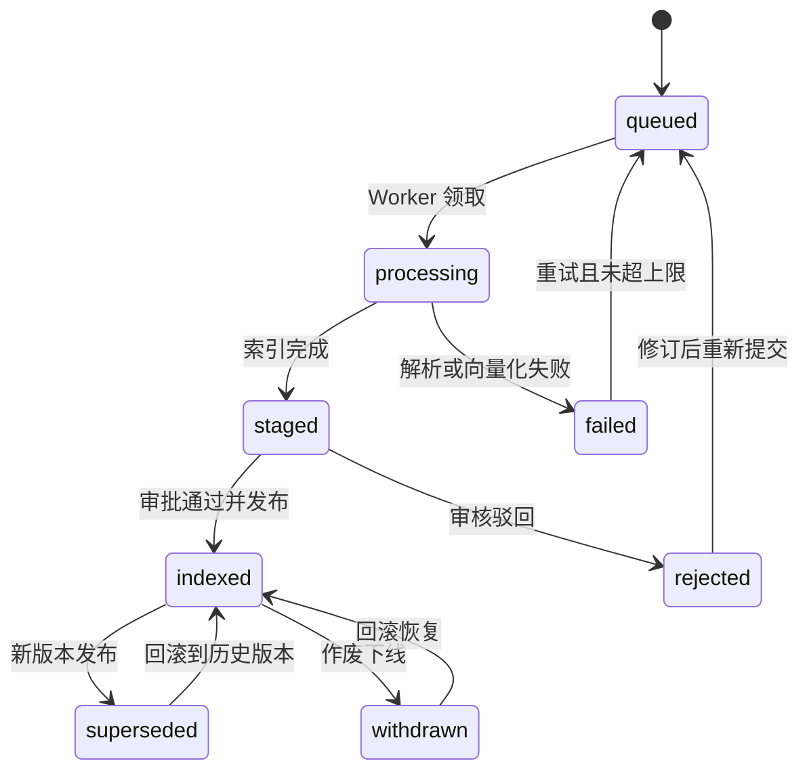

# DocMind IT 助手：业务结构蓝图（v1 评审稿）

> **状态：批次 1-4 已全部实现。**
> 本文档是升级总纲；数据表、字段、DDL 与迁移批次见
> [知识供给治理数据模型](knowledge-governance-data-model.md)。
> 实现偏差与最终状态见 §12「实施状态」。

## 0. 决策记录

| 项 | 结论 | 来源 |
|---|---|---|
| 优先业务域 | 知识供给与治理流程（审批发布、异步 Worker、作废回滚、评测门） | 本轮确认 |
| 部署形态 | 单企业内部私有化，单租户 | 本轮确认 |
| 依赖边界 | 允许引入 LangGraph / LangSmith | 本轮确认 |
| 推进方式 | 先设计、评审通过后再实现 | 本轮确认 |
| 六个决策点 | 全部按建议执行（`indexed` 语义保持、admin 不自动获得发布权、默认 `direct`、生产已强制 PostgreSQL、LangSmith 暂不启用、`queries.question` 单列一批） | 用户确认 |

复核基线（写这份文档时的实测状态）：

- `requirements-lock.txt` 共 39 个包，LangChain 家族为 **0**；运行时只有 `httpx` 做模型调用。
- `docs/isolation-boundary.md:30` 禁止查询服务出现 `agent`/`tools`/`orchestrator`，但
  `tests/test_isolation_boundary.py:7` 的扫描范围是 `app.py`、`assistant/`、`backend/`，
  **不含 `ingestion/`**。即：当前把 LangGraph 直接写进 `ingestion/`，边界测试会放行。
  这必须在批次 3 修掉（见 §8）。

## 1. 结论摘要

**本项目缺的不是检索技术，而是"知识从哪来、谁批、何时生效、错了怎么撤回"的治理结构。**

现状用一句话概括：`ingestion/service.py:45-77` 的导入流程是
`begin_document_import → embedding → complete_document_import`，
而 `complete_document_import`（`backend/database.py:265-297`）会把版本状态直接置为
`indexed` 并写 `published_at`，同时把上一个 `indexed` 版本改成 `superseded`。

**也就是说：导入即发布，没有中间态、没有审批人、没有留痕、没有门禁、没有撤回。**

目标形态：

1. 导入不再等于发布，版本有显式状态机（§4）；
2. 审批有角色、有职责分离、有 append-only 留痕（§3、§5）；
3. 重活交给可恢复、可重试、可观测的异步 Worker（§6）；
4. 发布前有过评测门，让"能不能上线"从人工直觉变成可量化结论（§7）；
5. 因为引入了 LangGraph/LangSmith，隔离边界要**收紧而不是放宽**（§8）。

本轮**不做**的事（防止范围蔓延）：多租户、组织/用户组实体表、回答质量闭环、成本配额治理、
交付运维与 `queries.question` 明文留存治理——它们在 §9 列为后续域，但本轮数据模型要为它们留位。

## 2. 业务结构全景

| 域 | 业务问题 | 现状 | 本轮 | 后续批次 |
|---|---|---|---|---|
| **A 知识供给与治理** | 知识谁维护、谁批准、何时生效、如何撤回 | 导入即发布，无审批、无门禁、无撤回 | **深潜（本文档）** | — |
| B 权限与组织模型 | 用户/用户组/部门从哪来、如何退役 | 只有 OIDC claim 里的 role/group 字符串，ACL 直接存 `principal_id`（`db_models.py:139-159`） | 仅扩展治理角色与能力 | 批次 5+ |
| C 回答质量闭环 | 回答好不好、错在哪、谁来改 | `citations` 仅存在于响应 JSON（`assistant/service.py:270`），无反馈、无缺口统计 | 评测表为 C 打基础 | 批次 6 |
| D 成本与配额 | 云模型会不会失控 | 有 Token/费用账本（`db_models.py:47`），无预算、无配额、无限流、无熔断 | 不做 | 批次 6 |
| E 数据生命周期与合规 | 问答正文留存多久、谁能看、如何导出 | `queries.question` **明文入库**（`db_models.py:39`），与 `README.md:27`"日志不记录正文"是两套口径 | 不做（见决策点 6） | 批次 5 |
| F 交付与运维 | 能不能上线并被 SRE 接管 | 无异步 Worker、无对象存储、无可观测性、无备份恢复 | 异步 Worker 属本轮 | 批次 7 |

## 3. 治理角色与职责

### 3.1 必须先解决的工程事实

`backend/auth.py:15` 定义 `ROLE_LEVELS = {"viewer": 1, "auditor": 2, "admin": 3}`，
而 `backend/auth.py:224` 的 `_principal()` 做的是：

```python
normalized_roles = frozenset(...) & ROLE_LEVELS.keys()
```

**不在 `ROLE_LEVELS` 里的角色会被静默丢弃。** 因此"在 OIDC 里给用户配一个 `knowledge_reviewer`
角色"这件事，今天配了也不会生效，而且不报错、不告警。所有新增角色必须同时扩展已知角色集合。

### 3.2 为什么不能用等级制表达审核与发布

现有 `Principal.allows()`（`auth.py:32-34`）是 `>=` 语义的线性等级。若把 `publisher` 放在 `admin` 之上，
`publisher` 会继承 `admin` 的导入与 ACL 写入能力；若放在之下，`admin` 会天然获得发布权。
**等级制无法表达职责分离**，而职责分离恰恰是知识治理的核心控制点。

结论：**新增能力制，保留等级制兼容**。

- `ROLE_LEVELS` 原样保留 → 既有 `Depends(auditor)` / `Depends(admin)` 端点行为不变；
- 新增 `CAPABILITIES: dict[str, frozenset[str]]`，端点用 `require("document.review")` 之类的依赖；
- `Principal` 增加 `capabilities` 属性，由 `roles` 推导；
- 角色白名单 `KNOWN_ROLES = ROLE_LEVELS.keys() | CAPABILITIES.keys()`，替代 `auth.py:224` 的过滤集合。

### 3.3 角色与能力矩阵

| 角色 | 来源 | 能力 |
|---|---|---|
| `viewer` | 现有 | `query.read`、`history.self.read` |
| `auditor` | 现有 | + `audit.read`、`document.read`、`usage.read` |
| `admin` | 现有 | + `acl.write`、`model.write`、`artifact.write`（**不自动包含** `document.publish`，见决策点 2） |
| `knowledge_editor` | 新增 | `document.write`（上传/发起变更）、`document.read` |
| `knowledge_reviewer` | 新增 | `document.review`、`evaluation.run`、`document.read` |
| `knowledge_publisher` | 新增 | `document.publish`、`document.withdraw`、`document.rollback`、`document.read` |
| `evaluation_runner` | 新增（可选） | `evaluation.run` |

安全约束（必须写进测试）：

1. **治理角色不进入 `Principal.acl_roles`**（`auth.py:37-45`）。否则给某人一个 `knowledge_reviewer`
   会顺带扩大他能检索到的文档范围——这是权限提升漏洞，不是功能。
2. 治理角色同样受 `guest` 剥离逻辑约束（`auth.py:38`、`:49`），游客永远拿不到治理能力。
3. `require()` 依赖必须在**未认证时返回 401、已认证但无能力时返回 403**，与现有 `Depends` 分层保持一致。

### 3.4 治理职责（RACI）

| 活动 | 知识 Owner | 编辑 | 审核 | 发布 | 审计 | 平台管理 |
|---|---|---|---|---|---|---|
| 提出知识变更 | A | R | C | I | — | — |
| 提交版本 | I | R | — | — | — | — |
| 内容审核 | A | C | R | I | — | — |
| 评测门判定 | I | — | R | C | I | — |
| 发布上线 | I | — | C | R | I | — |
| 作废/回滚 | A | C | C | R | I | I |
| 留痕合规检查 | I | — | — | — | R | C |

## 4. 知识生命周期状态机

### 4.1 状态定义

| 状态 | 含义 | 可被检索 | 谁可进入 |
|---|---|---|---|
| `queued` | 已接收，等待 Worker | 否 | 编辑（提交） |
| `processing` | 解析/分块/向量化中 | 否 | Worker |
| `staged` | 索引完成，等待审核 | 否 | Worker |
| `indexed` | **已发布（保留原值语义）** | **是** | 发布者 |
| `rejected` | 审核驳回 | 否 | 审核者 |
| `withdrawn` | 已发布后作废下线 | 否 | 发布者 |
| `superseded` | 被新版本取代 | 否 | 系统 |
| `failed` | 处理失败 | 否 | Worker / 系统 |

### 4.2 状态迁移



### 4.3 关键设计决策：保留 `indexed` 表示"已发布"

检索路径中有四处硬编码 `status = 'indexed'`：

- `backend/database.py:341`（`has_indexed_chunks`）
- `backend/database.py:376`（`accessible_document_outline`）
- `backend/database.py:430`（`lexical_search`）
- `backend/database.py:462`（`_postgres_hybrid_search`）

若把"已发布"改名为 `published`，这四处 SQL、SQLite 便携分支、以及
`test_document_ingestion_retrieval.py` 的多处断言都要同步修改，收益只是命名更顺眼。

**建议：`indexed` 继续表示"已发布且可检索"**，新增的是它**之前**的状态。
这样"检索可见性"这条最敏感的不变量代码零改动，风险最低。见决策点 1。

### 4.4 不变量

1. **任一 document 在同一时刻最多一个 `indexed` 版本。** 由发布动作原子地
   `旧 indexed → superseded` + `新版本 → indexed` 保证（沿用 `database.py:289-293` 现有做法）。
2. **不可检索状态绝不出现在任何召回路径中**——这是本轮最需要被测试钉死的断言。
3. `withdrawn` / `rejected` **不删除**原文件与分块（`document_sources.py` 的 `v<version>-<filename>`
   与 `document_chunks` 行都保留），只退出检索并写审计。理由：取证、申诉、回滚都需要原始证据。
4. `failed` 保留 `error_code`（现有 `fail_document_import` 已有该列），供运维定位。

## 5. 审批发布流程

### 5.1 主流程

1. 编辑上传文件 → 创建 `document_versions` 行（`queued`）+ `ingestion_jobs` 行 → 返回 202 + `job_id`。
2. Worker 领取 → `processing` → 解析、分块、向量化、落 `document_chunks` → `staged`。
3. 审核者在待审列表看到该版本 → 可预览 staged 分块 → 通过（进入发布）或驳回（`rejected` + 意见）。
4. 发布者触发发布 → 可选先跑评测门（§7）→ 发布动作原子执行 → `indexed`，旧版本 `superseded`。
5. 任何一步都有 append-only 记录（`document_version_reviews`）。

### 5.2 职责分离

默认强制：`document_version_reviews` 中的 `submit` 主体与 `approve` 主体**不得相同**。

- 配置：`IT_GOVERNANCE_REQUIRE_SEPARATION_OF_DUTIES=true`（默认）。
- 小团队例外：`IT_GOVERNANCE_ALLOW_ADMIN_OVERRIDE=true` 时 `admin` 可单人完成，
  但必须走 `override` 动作并留痕（不静默放行）。
- 被拒时错误码固定为 `separation_of_duties_violation`，便于测试与告警。

### 5.3 驳回后如何处理

被驳回的版本保留其 `content_sha256` 与历史意见。修订后重新提交有两条路：

- **建议：产生新版本号**（`rejected` 版本永久保留）。理由：被拒内容也是证据链，覆盖它会破坏审计。
- 注意现有 `begin_document_import`（`database.py:242-245`）对已存在同 hash 版本会**重置该行**为
  `pending`。改为新版本策略后，这个"复用行"逻辑必须同步修改，否则会覆盖被拒证据。

### 5.4 作废与回滚

| 动作 | 效果 | 能力 | 留痕 |
|---|---|---|---|
| 作废 | 当前 `indexed` → `withdrawn`，退出检索 | `document.withdraw` | 必须填原因（`withdrawn_reason`） |
| 回滚 | 指定历史版本 → `indexed`，当前版本 → `superseded` | `document.rollback` | 必须填原因 |
| 恢复 | `withdrawn` → `indexed`（仅发布者） | `document.publish` | 必须填原因 |

回滚是**重新向量化还是直接复用分块**？设计上选择复用：`document_chunks` 按版本行存储，
历史版本的分块仍在库中，回滚只需改状态，不需要重新调用 Embedding（省时省钱且可离线执行）。
代价是历史分块占存储——这是可接受的交换。

## 6. 异步 Worker 与 LangGraph 采纳方案

### 6.1 现状问题

`admin_app.py:525-587` 的导入端点在请求内跑完整条流水线（`run_in_threadpool` 只是避免阻塞事件循环，
**HTTP 请求仍然要等到向量化结束**）。后果：

- 大文档导入 → 请求超时、网关 504、前端卡死；
- 失败无自动重试，只能人工重来；
- 进程重启 → 正在处理的任务既不在队列里也不可见，只在库里留一个 `failed`。

### 6.2 设计原则：业务队列自研，框架只做任务内编排

**不把业务状态藏进框架的 checkpoint。** 理由：

- 管理员需要看到任务列表、能重试、能取消、能按文档筛选——这是业务需求，不是框架内部状态；
- 审计要求"谁在什么时候提交了什么"，checkpoint 的形态不受我们控制，也不适合做审计源；
- 业务队列可独立限流与配额，与后续域 D（成本配额）天然衔接。

因此：

| 层 | 归属 | 职责 |
|---|---|---|
| 业务队列 | `ingestion_jobs` 表（自研） | 可见、可审计、可重试、可取消、可限流 |
| 任务内编排 | LangGraph | 节点拓扑、节点级重试、断点续跑 |
| 数据持久化 | 现有 `document_*` 表 | 唯一事实来源 |

### 6.3 图拓扑

```text
parse → chunk → embed → persist_chunks → stage → [eval_gate]
```

- `parse`：复用 `ingestion/parsers.py`（无框架依赖，可独立测试）。
- `chunk`：复用 `ingestion/chunker.py`。
- `embed`：复用 `backend/embeddings.py`，调用的 Token 与费用继续写 `model_usage_ledger`
  （`database.py:177-203` 已有 `record_embedding_usages`，保持不动）。
- `persist_chunks`：先删后插（沿用 `database.py:273-275` 现有做法）保证幂等。
- `stage`：置 `staged`，**不发布**。
- `eval_gate`：按 `IT_EVAL_GATE_MODE` 决定是否在发布前跑评测。

### 6.4 检查点、幂等与恢复

- 检查点存储：`langgraph-checkpoint-postgres`（模块 `langgraph.checkpoint.postgres`，
  官方同时提供 `langgraph.checkpoint.sqlite` 供本地使用）。
  参考：[langgraph.checkpoint.postgres](https://reference.langchain.com/python/langgraph.checkpoint.postgres)。
- 幂等键：`(document_version_id, node_name)`。每个节点必须可重复执行且结果一致——
  `persist_chunks` 用"先删后插"，`stage` 用条件更新（仅当 `status='processing'` 才置 `staged`）。
- 进程被杀：Worker 重启后按 `ingestion_jobs.status='running'` + `heartbeat_at` 超时回收，
  再从 LangGraph 检查点续跑；若检查点不可用，允许从 `queued` 整任务重跑（幂等保证安全）。

### 6.5 并发、抢占与方言差异

- PostgreSQL：`SELECT ... FOR UPDATE SKIP LOCKED` 抢占任务，支持多 Worker 水平扩展。
- SQLite：**没有 `SKIP LOCKED`**。因此：
  - 开发/测试：单 Worker 串行（乐观更新 `UPDATE ... WHERE status='queued'` 认领）；
  - 生产：`backend/config.py:160-163` 已强制 `IT_DATABASE_URL` 为 PostgreSQL，
    因此生产环境可安全依赖 `SKIP LOCKED` 做无重复抢占（无需新增校验）。
- 僵尸回收：`locked_at` + `heartbeat_at`，超过 `IT_INGESTION_JOB_TIMEOUT_SECONDS` 未心跳 →
  回到 `queued` 并 `attempts += 1`；超过 `IT_INGESTION_MAX_ATTEMPTS` → `failed` + `last_error_code`。

### 6.6 保留同步通道

`ingestion/cli.py` 的同步导入**保留**，作为应急与首次批量导入通道（它不依赖 Worker，
也不依赖 LangGraph）。这保证"异步子系统坏掉时，知识仍能导入"——企业落地必须有这条退路。

### 6.7 代码落位

- 新增 `worker/` 包（进程入口 `worker/main.py`）：队列轮询、抢占、LangGraph 调用、心跳。
- `ingestion/` 只保留纯函数式步骤（parse/chunk），**不引入框架依赖**，保证可单测、可 CLI 复用。
- `backend/` 与 `assistant/` 保持零框架依赖（隔离闭包要求，见 §8）。

## 7. 评测门

### 7.1 为什么必须有

"发布"今天完全靠人工直觉。企业上线后知识会持续变更，**没有回归门就等于每次改文档都在赌**。
评测门同时是域 C（回答质量闭环）的数据基础。

### 7.2 最小可用设计

| 组成 | 内容 |
|---|---|
| 黄金题集 | `evaluation_cases`：问题、期望命中的文档/章节、是否为"应拒答"题 |
| 运行记录 | `evaluation_runs`：触发方式、被门禁的版本、指标、门禁结论 |
| 逐题结果 | `evaluation_case_results`：是否命中、排名、引用是否正确、拒答是否正确 |
| 门禁模式 | `IT_EVAL_GATE_MODE=off | warn | block`（建议默认 `warn`） |
| 触发点 | `manual`（人工）、`pre_publish`（发布前自动） |

指标：`recall@k`、引用命中率、拒答正确率、**相对上一个 run 的回归幅度**。

### 7.3 最重要的设计约束

**评测必须复用生产检索路径**（`QueryDatabase.hybrid_search` + 与查询完全相同的 ACL 组装逻辑）。
如果评测走一条"简化版检索"，评测结论就与线上无关——这是评测体系最常见的失败模式。

实现要求：评测 harness 只做"组装主体 → 调 `hybrid_search` → 断言结果"，不得复制检索 SQL。

### 7.4 门禁与强推

- `block` 模式下，未达标版本**不能**从 `staged` 进入 `indexed`。
- 发布者强推必须走 `override`：需要 `document.publish` 能力 + 填写理由 + 写
  `evaluation_gate_override` 审计事件。**绝不静默放行。**

## 8. 隔离边界修订提案（因允许 LangGraph/LangSmith）

### 8.1 矛盾点

- `docs/isolation-boundary.md:30` 禁止查询服务出现 `agent`/`tools`/`orchestrator` 模块；
- `tests/test_isolation_boundary.py:8-12` 用**名字黑名单**实现该禁令；
- 而扫描范围 `SOURCE_ROOTS`（`:7`）**不含 `ingestion/`**，也不含将来的 `worker/`。

名字黑名单本身就容易被绕过（换个包名即可）；扫描范围又漏了最需要约束的导入链路。
引入 LangGraph/LangSmith 后必须**同时收紧这两处**。

### 8.2 提案：把"名字黑名单"升级为"入口闭包检查"

新规则一句话：**从 `app.py` 出发的可达 import 闭包内，不得出现任何 LLM 编排或追踪框架。**

为什么比黑名单强：它约束的是"查询进程实际会加载什么"，而不是"某个文件里写了什么字符串"。
即使有人把 `langgraph` 包一层 `backend/whatever.py` 再导入，闭包检查依然能抓到。

### 8.3 建议直接采用的措辞

`docs/isolation-boundary.md` §2 允许能力新增一条：

> - 在**非查询进程**（`ingestion/`、`worker/`）中使用 LangGraph 进行导入任务编排，
>   并使用 LangSmith 进行**脱敏后**的任务追踪；查询进程不得加载上述框架。

`docs/isolation-boundary.md` §3 保持禁令不变，并补充：

> | Agent 编排框架进入查询进程 | `langgraph`、`langchain_core`、`langsmith` | 查询进程只做检索，引入编排框架会扩大行为权限与攻击面 |

`docs/isolation-boundary.md` §5 自动守卫改写为：

> `tests/test_isolation_boundary.py` 从 `app.py` 出发计算 import 闭包，并拒绝：
> 闭包内出现开发 Agent、工作台、游戏、进程执行模块或 LLM 编排/追踪框架；
> 同时扫描范围扩展至 `ingestion/` 与 `worker/`（对这两个目录仅禁止进程执行与查询进程反向导入）。

### 8.4 对应的测试改动

| 测试 | 断言 |
|---|---|
| `test_query_import_closure_excludes_orchestration_frameworks` | 从 `app.py` 递归解析 import，闭包 ∩ `{langgraph, langchain_core, langsmith}` 为空 |
| `test_query_import_closure_excludes_process_execution` | 现有 `subprocess` 禁令改为闭包内检查（比逐文件更严格） |
| `test_worker_does_not_import_query_entrypoints` | `worker/` 不得导入 `app.py` / `assistant`（防止反向耦合） |
| `test_langsmith_disabled_by_default` | `AppSettings` 默认 `langsmith_enabled == False` |

### 8.5 LangSmith 数据出境口径

⚠️ 这是本轮**唯一涉及数据外发**的改动，必须按最保守方式处理：

| 项 | 要求 |
|---|---|
| 默认状态 | **关闭**（`IT_LANGSMITH_ENABLED=false`） |
| 禁止上报 | 文档正文、分块正文、问题正文、回答正文、API Key、OIDC Token |
| 允许上报 | 节点名、耗时、状态、`document_id`、`version`、`content_sha256`、Token 数与费用 |
| 生产校验 | 开启时强制 `https://` 且 `IT_LANGSMITH_HIDE_CONTENT=true` |
| 部署建议 | 单企业内部私有化场景，SaaS 上报等于把知识元数据外发；若确需启用，优先自托管（需 K8s + PostgreSQL + Redis 与商业 license，见 [LangSmith 自托管部署](https://docs.langchain.com/langsmith/deploy-to-self-hosted-overview)） |

## 9. 后续域与本轮的接口

| 域 | 后续要什么 | 本轮需要留的位 |
|---|---|---|
| B 组织模型 | 用户表、用户组表、部门 | `document_acl.principal_id` 保持字符串（不做外键），将来加 `org_unit` 列即可 |
| C 质量闭环 | 引用持久化、用户反馈、知识缺口 | `evaluation_cases` 就是黄金题的家；引用表将来从 `queries` 反查 |
| D 成本配额 | 预算、配额、告警 | `ingestion_jobs.payload` 可承载配额判定；`model_usage_ledger` 不动 |
| E 生命周期 | 保留策略、审计导出、正文脱敏 | `document_version_reviews` append-only 便于导出；`queries.question` 问题单列 |
| F 交付运维 | 对象存储、指标、备份恢复 | `ingestion_jobs` 天然是 Worker 健康度的指标源 |

## 10. 待你确认的决策点

| # | 决策 | 我的建议 | 影响 |
|---:|---|---|---|
| 1 | `indexed` 继续表示"已发布"，还是改名 `published` | **保持 `indexed`** | 改名要动 4 处 SQL + 便携分支 + 多处测试断言，收益仅命名 |
| 2 | `admin` 是否自动拥有 `document.publish` | **不自动拥有**（需显式授予） | 若自动拥有，职责分离在只有 admin 的环境下形同虚设 |
| 3 | `IT_GOVERNANCE_MODE` 默认值 | **默认 `direct`（保持现状行为）**，生产文档要求 `review` | 默认 `review` 会让现有测试与本地演示立即变行为 |
| 4 | 生产异步 Worker 要不要强制 PostgreSQL | **无需新决策：现有校验已保证** | `backend/config.py:160-163` 已在生产环境强制 PostgreSQL，多 Worker 抢占可安全依赖 `SKIP LOCKED` |
| 5 | LangSmith 怎么用 | **暂不启用，只留配置与脱敏接口** | 启用需先定自托管还是 SaaS，涉及数据出境评审 |
| 6 | `queries.question` 明文留存是否本轮一并处理 | **单独开一批（域 E）** | 混进本轮会让治理改造与合规改造互相阻塞 |

## 11. 实施批次与验收

四个批次，每批都必须满足：迁移可升可降、`unittest` 全绿、隔离测试全绿、
`README.md` / `PROJECT_STATUS.md` 同步更新。

| 批次 | 内容 | 主要落点 | 验收标准（可测） |
|---:|---|---|---|
| 1 | 治理状态机 + 能力制 + 审批发布 + 作废回滚 | `backend/auth.py`、`backend/database.py`、`backend/db_models.py`、`admin_app.py`、`web/admin.*`、迁移 0008 | `staged`/`rejected`/`withdrawn` 版本在 `hybrid_search`、`lexical_search`、`accessible_document_outline` 中**均不可见**；无 `document.publish` 能力发布返回 403；同一主体提交+审批被拒；迁移升降级通过 |
| 2 | 异步 Worker + 任务可见性与重试 | 新增 `worker/`、`ingestion_jobs`、迁移 0009、`admin_app.py` 导入端点 | 导入请求在 1 秒内返回 202；Worker 被杀后任务可被回收续跑；重复投递不产生重复分块；超上限进 `failed` 且 `last_error_code` 可读 |
| 3 | LangGraph 编排 + 边界收紧 | `worker/`、`tests/test_isolation_boundary.py`、`docs/isolation-boundary.md`、`requirements*.txt` | 查询进程 import 闭包内无 `langgraph`/`langsmith`；断点续跑测试通过；`pip check` 与漏洞扫描通过；边界文档与测试同步 |
| 4 | 评测门 + 可选 Trace | 迁移 0010、`worker/`、`admin_app.py`、`web/admin.*` | `block` 模式能阻断未达标发布；`override` 必定留痕；Trace 开启时断言载荷不含正文 |

**批次 1 是本轮的核心**，它单独就能把"导入即发布"这个最大的治理缺口补上。
批次 2 依赖 1 的状态机，批次 3 依赖 2 的 Worker，批次 4 依赖 1 的发布动作。

## 12. 实施状态

### 批次 1：已实现（迁移 `20260921_0008`）

| 设计项 | 落地位置 | 状态 |
|---|---|---|
| 能力制角色与白名单 | `backend/auth.py`（`GOVERNANCE_ROLES`/`KNOWN_ROLES`/`LEVEL_CAPABILITIES`/`ROLE_CAPABILITIES`/`Principal.capabilities`） | 已实现 |
| 治理角色不进入 ACL | `Principal.acl_roles` 只保留等级角色 | 已实现（原实现会把任意角色并入 ACL，属权限提升风险） |
| 状态机与治理指针 | `backend/db_models.py`、`backend/database.py` | 已实现 |
| 审批留痕 | `document_version_reviews`（append-only）+ `/reviews` 接口 | 已实现 |
| 审批发布与职责分离 | `review_document_version` / `publish_document_version` | 已实现 |
| 作废与回滚 | `withdraw_document_version` / `rollback_document_version` | 已实现 |
| 审核预览（含审计） | `document_version_chunks` + `/preview` | 已实现 |
| 导入不再改写访问范围 | `begin_document_import` 的 `access_scope_change_requires_acl` | 已实现（§6.4 的越权路径已封堵） |
| 管理端 UI | `web/admin.html` / `admin.js` / `admin.css` 的治理视图、预览对话框、版本操作与原因对话框 | 已实现 |
| 测试 | `tests/test_knowledge_governance.py`（5 个用例）、`tests/test_database_migrations.py`（治理迁移升降级） | 已实现 |

### 与设计的偏差（已按此实现，评审时请注意）

1. **审核通过不改变状态**：`approve` 只写授权记录，版本保持 `staged`；发布时校验必须存在 `approve` 记录。设计原文没有明确"授权"与"发布"是两个动作，实现按更严格的方式拆开，因此 `staged → indexed` 无法被单个动作完成。
2. **`document_version_reviews` 增加 `is_override` 布尔列**：设计只列了 `action/actor/comment`，实现增加显式标记，避免"管理员越权"只能靠注释文字表达。
3. **自引用外键在两种方言都建立**：原计划仅在 PostgreSQL 建 `superseded_by_version_id` 外键，实现改为双方言都建（SQLite 走批量重建表），收益是 `alembic check` 无差异、开发与生产 schema 一致。
4. **`complete_document_import` 保留**：作为 `finalize_document_indexing(publish=True)` 的薄包装，避免 CLI 与既有测试被破坏。
5. **评测门与 LangSmith 未启用**：分别属于批次 4 与批次 3；`document_version_reviews.action` 的 CHECK 约束已预留 `override_gate`，批次 4 无需再改约束。

### 批次 2：已实现（迁移 `20260921_0009`）

| 设计项 | 落地位置 | 状态 |
|---|---|---|
| 业务队列表 | `ingestion_jobs`（迁移 0009、`backend/db_models.py`） | 已实现 |
| 队列仓储 | `backend/database.py`：enqueue / claim / heartbeat / complete / fail / reclaim / retry / cancel / stats | 已实现 |
| Worker 进程 | `worker/runner.py`（调度、失败分类、僵尸回收）、`worker/main.py`（`python -m worker`，支持 `--once`） | 已实现 |
| 异步导入 | 导入端点在 `IT_INGESTION_WORKER_ENABLED=true` 时返回 `202 + job_id` | 已实现 |
| 任务可见性与重试/取消 | `/api/admin/ingestion/jobs`、`.../retry`、`.../cancel` | 已实现 |
| 队列健康诊断 | `/health/ready` 的 `ingestion` 诊断字段 | 已实现 |
| 管理端 UI | "导入任务"视图：队列指标、任务列表、重试与取消 | 已实现 |
| 测试 | `tests/test_ingestion_jobs.py`（9 个用例） | 已实现 |

#### 与设计的偏差（评审时请注意）

1. **普通唯一约束替代部分唯一索引**：改为 `uq_ingestion_jobs_target (job_type, version_id)`，
   "重新投递"复用同一行并重置尝试次数。理由见数据模型文档 §4.3。
2. **队列停滞不放进 `checks`**：设计未明确摆放位置，实现把 `ingestion` 作为诊断字段放在
   `checks` 之外。队列停滞意味着"没有 Worker 在消费"，重启 Pod 无法修复，
   因此不应触发就绪探针失败与自动重启。
3. **取消"production + review 必须启用 Worker"的生产校验**：同步导入在 `review` 模式下依然成立
   （索引在请求内完成，终点是 `staged`），强制启用会无理由阻断一种合法部署。
4. **重试退避只在进程内**：可重试失败立即重排，`run_forever` 用进程内指数退避避免打爆供应商；
   持久化的 `next_attempt_at` 留给后续批次（已记入 README 当前限制）。
5. **`reindex` / `withdraw` / `evaluate` 显式失败**：任务表已支持这些类型，Worker 尚未实现，
   遇到即以 `job_type_unsupported` 终止，绝不静默跳过。
6. **LangGraph 未进入 Worker**：批次 2 的 Worker 是纯 Python 编排，LangGraph 与隔离边界收紧属批次 3。

### 批次 3：已实现

| 设计项 | 落地位置 | 状态 |
|---|---|---|
| LangGraph 图编排 | `worker/graph.py`：`prepare → embed_batch（循环）→ finalize` | 已实现 |
| 断点续跑 | 每批向量化后落 checkpoint；`staging` 丢失时丢弃 checkpoint 重跑 | 已实现（有专门测试） |
| 引擎开关 | `IT_INGESTION_ENGINE=simple\|langgraph`、`IT_INGESTION_CHECKPOINT_PATH`、`--engine` | 已实现 |
| checkpoint 隔离 | 独立 SQLite 文件 / 独立 PostgreSQL schema，绝不写应用 schema | 已实现（测试校验 `alembic check` 仍干净） |
| 依赖可选化 | `requirements-worker.txt` + `requirements-worker-lock.txt`（+32 包，核心 39 包零变化） | 已实现 |
| 边界收紧 | `docs/isolation-boundary.md` §2.1/§3/§4/§5/§6 已修订 | 已实现 |
| 闭包守卫 | `tests/test_isolation_boundary.py`：从 `app.py` 递归求 import 闭包，禁止编排/追踪框架 | 已实现 |
| 测试 | `tests/test_indexing_graph.py`（4 个用例）+ 边界测试由 2 个扩到 6 个 | 已实现 |

#### 与设计的偏差（评审时请注意）

1. **LangGraph 是可选引擎，不是唯一路径**：默认 `simple`。原始设计把 LangGraph 写成既定方案，
   实现时把"框架依赖"变成部署方的显式选择——`requirements.txt` 保持 39 个包，
   只有 Worker 部署才引入 LangGraph 与 32 个传递依赖。
2. **LangSmith 明确未启用**：决策 5 是"暂不启用"；批次 3 只引入 LangGraph。代码里没有任何
   设置 `LANGSMITH_TRACING` / `LANGCHAIN_TRACING` 的地方，并且有测试禁止，
   因此"允许引入 LangSmith"没有被兑现成"已经在往外部上报"。
3. **状态刻意不存 chunk 正文**：图状态只保存控制变量（cursor/batch_total/路径），
   分块内容落到 staging 文件。否则一个 2M 字符文档会把 checkpoint 撑到几十 MB。
4. **`embed_batch` 自循环而非 fan-out**：逐批串行便于精确 checkpoint，也便于按批计费与重试；
   并行批次会让"哪几批已付费"变得难以判定。
5. **PostgreSQL checkpoint 路径的集成测试缺口已在 A-2 关闭**：实现完整（独立 schema + `PostgresSaver`），
   批次 3 当时 CI 没有 PostgreSQL 服务，因此该路径只有单元级覆盖（DSN 转换），SQLite 路径有完整测试。
   后续补上 `tests/test_indexing_graph_postgres.py` 与 CI 的 PostgreSQL 16 服务，覆盖建表、续跑不重复计费
   与"checkpoint 表不落在应用 schema"三条性质；本机没有 PostgreSQL 时该模块自动跳过。
6. **闭包守卫的强度边界**：它拦截静态 import 与 `import_module`/`__import__`/`sys.modules` 动态导入；
   它无法拦截"运行期通过 `eval` 拼出的模块名"。这是测试而非沙箱，真正的隔离仍靠容器与网络策略。

### 批次 4：已实现（迁移 `20260921_0010`）

| 设计项 | 落地位置 | 状态 |
|---|---|---|
| 黄金题集 | `evaluation_cases`（`case_key` 唯一，可停用不可删已引用用例） | 已实现 |
| 评测运行 | `evaluation_runs`（trigger/status/gate_mode/gate_result 受 CHECK 约束）+ `evaluation_case_results` | 已实现 |
| 复用生产检索路径 | `EvaluationService` 调用 `HybridRetriever.retrieve`（同嵌入、同 ACL、同混合检索与降级） | 已实现（测试统计 `hybrid_search` 调用次数） |
| 指标 | recall@k、引用命中率、拒答正确率、基线回归 | 已实现 |
| 门禁 | `off`/`warn`/`block`，`block` 时发布返回 409 | 已实现 |
| 越权放行 | `IT_EVAL_ALLOW_OVERRIDE` + 双能力 + 显式请求 → `override_gate` 留痕 | 已实现 |
| 管理端 UI | "评测门"视图：题集增改停用、运行、逐题明细 | 已实现 |
| 测试 | `tests/test_evaluation_gate.py`（6 个用例） | 已实现 |

#### 与设计的偏差（评审时请注意）

1. **`citation_accuracy` 的分母改为"应答题"**：设计原文写的是"命中期望文档的题目数"，
   实现改为与 `recall_at_k` 同分母（需要命中的题数）。理由：这样 `citation_accuracy ≤ recall_at_k`
   恒成立，是一个能立刻发现度量 bug 的不变量；若分母是"命中数"，recall 极低时引用率反而可能虚高。
2. **新增 `gate_reason` 列与 `IT_EVAL_ALLOW_OVERRIDE` 开关**：设计只列了 `gate_result`。
   没有原因就无法解释"为什么这一版被阻断"；而越权放行与职责分离是两种不同政策，
   共用一个开关会迫使企业二选一，因此独立成开关。
3. **越权放行要求"双能力"**：`document.publish` + `governance.override` 必须同时具备。
   只给发布权的人不能无视质量门禁。代价是发布经理需要被授予两个角色（已在 README 写明）。
4. **空黄金题只告警不阻断**：设计未明确。若空集在 `block` 模式下也阻断，第一天将无法发布任何知识；
   实现选择 `warn` 并在原因中写明"未判定"，界面上不会显示成通过。
5. **评测身份固定为 `system:evaluation` + `viewer`**：保证结论与操作者无关、可复现；
   代价是黄金题只能引用 viewer 可见的文档（受限文档需加 `role:viewer`，或等域 B 的知识域模型）。
6. **发布前评测同步执行**：题集很大时会拉长发布请求。声明过的 `evaluate` 任务类型尚未实现异步评测，
   已记入 README 当前限制。**LangSmith Trace 仍未启用**（决策 5），代码与测试都禁止隐式开启。
7. **状态冲突统一返回 409**：批次 2 的"重试运行中的任务""取消非排队任务"由 400 调整为 409，
   与"审核已发布版本"等状态冲突语义保持一致（`tests/test_ingestion_jobs.py` 已同步）。

### 后续批次

批次 1-4 全部交付。剩余工作见 `PROJECT_STATUS.md` 的后续工作清单（异步评测任务、
OIDC PKCE 登录、对象存储与保留策略、可观测性、检索重排与知识域模型、K8s 部署参考）。
