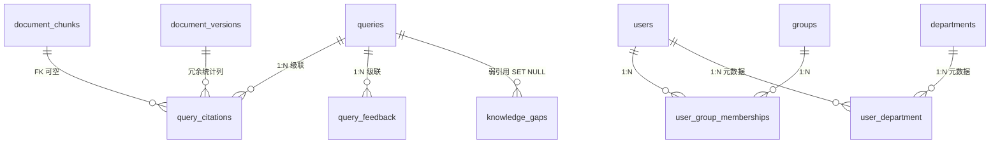

# PRD：DocMind「采购硬缺口」增量需求（引用 / 反馈 / 知识缺口 / 组织模型）

> **前置说明（已读文件与关键判断）**
> 1. 已读：`backend/db_models.py`、`backend/auth.py`、`backend/config.py`、`backend/database.py`（节选）、`admin_app.py`（鉴权与 `audit-events/export` 端点）。
> 2. 关键 schema 判断：①`queries.id` 为自增整型主键，`evidence∈{sufficient,insufficient}` 是当前唯一现成的"是否拒答/无证据"信号；②`document_acl.principal_id` 为字符串（user 用 HMAC-subject_id、group/role 用声明字符串），且查询期 ACL 在召回 SQL 中以字符串直接比对 `principal.acl_groups/acl_roles`，**热路径不应本轮改动**；③`Principal.subject_id` 是 HMAC 哈希、原始 OIDC `sub` 不落库；④回答的 `citations` 仅有两种形态（指向 document_chunks 的 `{source,version,chunk,section,page,score}`，或指向 knowledge.md 的 `{source,section,line}`），且**从未持久化**。
> 3. 域B 初步建议：**保守引入表、本轮不切换 ACL 写入/执行路径**——新表仅做登录态懒同步 + 管理端只读展现/名称解析；现有 `document_acl` 行因 principal_id 已与新表键同构，**无需数据迁移**；部门（department）因 OIDC 声明中无此字段，**本轮仅做元数据，不进 ACL 执行**。

---

## 1. 产品目标

**一句话**：补齐当前散落在响应 JSON 里、从未落库的"引用 / 用户反馈 / 知识缺口"三类信号，并以真实的 `users`/`groups`/`departments` 组织表取代 ACL 中基于 OIDC 声明的字符串映射，为"答案质量闭环"与"精细化授权"提供数据底座。

**成功度量（Success Metrics）**
- **M1**：≥95% 的问答请求其引用在返回时被落库（引用可溯源到具体 chunk）。
- **M2**：管理员可在 ≤2 次点击内导出任意时间窗的反馈/引用/缺口 CSV，且每次导出均自审计。
- **M3**：知识缺口（insufficient）从发生到被运营标记为"已补录/已忽略"的中位时长可度量并逐月下降（先建基线）。
- **M4**：组织模型上线后，管理端 ACL 列表/导出中 principal 展示从"裸字符串 ID"变为"可读名称"的比例 ≥90%，且 ACL 召回判定行为与上线前 **100% 一致**（回归零误差）。

---

## 2. 用户故事（按 4 子项）

### 2.1 引用持久化
- **作为** 知识运营，**我希望** 每次回答引用的文档分块被记录下来，**以便** 溯源"这条答案来自哪段证据"并统计高频命中内容。
- **触发条件**：用户发起一次检索式问答（response 含 citations）或知识库概览（含 chunk 引用）。
- **验收标准**：
  1. 每次回答落库其全部 citation（chunk 型与 knowledge.md 型均覆盖）。
  2. chunk 型引用可反查 `document_chunks.id` 与所属 `document_versions`；knowledge.md 型引用保留 `source/section/line` 且不虚指 chunk。
  3. 引用记录随 `queries` 生命周期级联保留/清理（FK `ondelete=CASCADE`）。

### 2.2 用户反馈
- **作为** 终端用户，**我希望** 对一条回答点"赞/踩"并可附简短评论，**以便** 系统知道答案是否有用。
- **触发条件**：用户在前端对某次 query 的回答提交反馈。
- **验收标准**：
  1. 可记录 `rating∈{positive,negative}` 与可选 `comment`（≤1000 字）。
  2. 同一用户对同一 query 重复提交则**更新而非堆叠**（幂等，按 `(query_id, actor_subject_id)` 唯一）。
  3. 反馈落库即携带 `actor_subject_id` 与 `created_at`。

### 2.3 知识缺口统计
- **作为** 知识运营，**我希望** 系统把"无证据/拒答"的查询自动登记为知识缺口，**以便** 后续针对性补录文档。
- **触发条件**：某次问答最终以 `evidence=insufficient`（拒答/无证据）收尾；或（P1）检索/生成置信度低于阈值。
- **验收标准**：
  1. 缺口行记录弱引用 `query_id`、问题摘要 `gap_summary`、 `gap_type`、触发时 `model_route`。
  2. 运营可将缺口标记为 `addressed`（关联补录的 `document_version`）或 `dismissed`。
  3. 缺口表在源头 query 被保留期硬删后**仍可读**（问题摘要独立留存，非明文复制整段问题）。

### 2.4 用户/组/部门实体（域 B）
- **作为** 管理员，**我希望** 在组织模型里看到真实可读的用户/组/部门，**以便** 在 ACL 管理时不再面对裸字符串 ID。
- **触发条件**：用户登录（懒同步建 `users` / 刷新 `groups` 成员）；管理员查看 ACL 或组织视图。
- **验收标准**：
  1. 登录即懒同步 `users`（`subject_id`、`display_name`、`last_seen`）与 `user_group_memberships`。
  2. 管理端可列出 `users`/`groups` 及其成员。
  3. 本轮 ACL 判定行为**不变**（不切换执行路径）。
  4. 部门因 OIDC 无声明，仅支持管理员手工维护（元数据）。

---

## 3. 需求池（P0 必做 / P1 建议 / P2 后续）

### P0（本轮必做）
- **P0-1** 新增 `query_citations` 表并落库每次回答引用（chunk 型 + knowledge.md 型），随 `queries` 级联。
- **P0-2** 新增 `query_feedback` 表（`rating`/`comment`/`actor`），同一 (query,user) 幂等更新。
- **P0-3** 新增 `knowledge_gaps` 表，在 `evidence=insufficient` 时自动登记；缺口独立留存问题摘要，源 query 删除不受影响。
- **P0-4** 新增 `users`/`groups`/`user_group_memberships` 表，登录懒同步；本轮只读展现 + 名称解析，**不**改 ACL 执行。
- **P0-5** 各新表配套管理端 GET 列表 + GET 导出端点（csv|json），统一 `audit.read` 鉴权 + 自审计（对齐 `audit-events/export`）。
- **P0-6** 新增 Alembic 迁移；SQLite 本地与 PG（CI）双方言校验通过。

### P1（建议）
- **P1-1** `knowledge_gaps` 的"低置信"触发（需先定义置信口径：检索 top_score 阈值或网关置信字段）。
- **P1-2** 缺口运营端点：`POST .../knowledge-gaps/{id}/resolve`（关联 version，需 `document.write`）、`/dismiss`。
- **P1-3** 组织端导出端点（`/org/users/export` 等 csv|json）。
- **P1-4** 在 ACL 管理/导出界面用组织表解析 `principal_id` → 可读名称（读侧富化）。
- **P1-5** 部门手工维护端点（增删部门、用户归属部门），元数据级。

### P2（后续 / 域 B-2）
- **P2-1** 切换 ACL 执行路径：召回 SQL 改为 JOIN 组织表（保持失败关闭），替换字符串比对。
- **P2-2** `document_acl.principal_id` 外键化（user→`users.subject_id`；group→`groups.key`）；迁移既有行。
- **P2-3** 部门级 ACL（扩展 `principal_type` 引入 `'department'`，需改 CHECK 约束与召回 SQL——高侵入）。
- **P2-4** 跨系统身份对齐：在 `users` 表可选存原始 OIDC `sub`（需评估 salt 保密与密钥管理）。

---

## 4. 管理端端点设计稿

鉴权统一：`require_capability("audit.read")` 查看/导出；写类运营操作（`resolve`/`dismiss`）用 `require_capability("document.write")`。导出沿用现有 `audit-events/export` 形态：`export_format∈{csv,json}`、支持时间/类型过滤、UTF-8 BOM（Excel 中文友好）、落盘前 `record_audit_event(action="*.export", target_type="...")` 自审计。

| 端点 | Method | 鉴权能力 | 主要出参字段 | 导出 |
|---|---|---|---|---|
| `/api/admin/citations` | GET | `audit.read` | id, query_id, document_chunk_id, document_version_id, source, section, page_number, score, citation_rank, created_at | — |
| `/api/admin/citations/export` | GET | `audit.read` | 同上（支持 start/end/query_id 过滤） | csv,json |
| `/api/admin/feedback` | GET | `audit.read` | id, query_id, actor_subject_id, rating, comment, created_at | — |
| `/api/admin/feedback/export` | GET | `audit.read` | 同上（支持 rating/actor 过滤） | csv,json |
| `/api/admin/knowledge-gaps` | GET | `audit.read` | id, query_id, gap_type, gap_summary, model_route, status, resolved_version_id, created_at, updated_at | — |
| `/api/admin/knowledge-gaps/export` | GET | `audit.read` | 同上（支持 gap_type/status 过滤） | csv,json |
| `/api/admin/knowledge-gaps/{id}/resolve` | POST | `document.write` | 更新 status=addressed + resolved_version_id，自审计 | — |
| `/api/admin/knowledge-gaps/{id}/dismiss` | POST | `document.write` | 更新 status=dismissed，自审计 | — |
| `/api/admin/org/users` | GET | `audit.read` | subject_id, display_name, email, status, last_seen_at, department_key(富化) | — |
| `/api/admin/org/groups` | GET | `audit.read` | group_key, display_name, member_count | — |
| `/api/admin/org/departments` | GET | `audit.read` | department_key, name, parent_key（P1 维护） | — |
| `/api/admin/org/users/export` 等 | GET | `audit.read` | 对应列表字段 | csv,json |

---

## 5. 待确认问题（重点：域 B 决策点）

### 5.1 域 B 组织模型草案（建议结构，本轮只读）
- `users(subject_id PK=HMAC hash, display_name, email, status, last_seen_at, created_at)` —— 键沿用现有 `subject_id`，无需改登录哈希逻辑。
- `groups(group_key PK=声明字符串, display_name, created_at)` —— 与现有 `document_acl.principal_id`（type='group'）同构，零迁移。
- `user_group_memberships(subject_id FK, group_key FK, created_at, PK(subject_id,group_key))` —— 登录懒同步。
- `departments(department_key PK, name, parent_key, created_at)` —— 纯元数据，OIDC 无来源，仅管理员维护。
- `user_department(subject_id FK, department_key FK, PK(subject_id,department_key))` —— 元数据级，不进 ACL。

### 5.2 需用户拍板的关键决策点
1. **是否本轮切换 ACL 写入/执行路径？** 建议**否**：本轮仅引入表 + 登录懒同步 + 只读展现，热路径（召回 SQL 的字符串比对）保持不动；切换留作 域B-2（P2）。请确认是否采纳"保守不切换"。
2. **是否引入"部门级 ACL"（扩展 principal_type 为 'department'）？** 建议**本轮不做**：它要改 `document_acl` 的 CHECK 约束与召回 SQL，侵入高且 OIDC 无部门声明无法自动赋值。请确认部门仅作元数据。
3. **知识缺口的"问题"如何留存？** `queries.question` 受 `query_field_key` 字段级加密保护；缺口表若明文复制整段问题会绕过该保护。建议：缺口表**只存 query_id 弱引用（SET NULL，源删除不连锁清缺口）+ 运营手工填写的非 PII `gap_summary`**，不复制原始问题。请确认是否接受"不复制明文问题"，或要求缺口表也实现同等字段加密。
4. **是否在本轮就把原始 OIDC `sub` 存入 users 表？** 当前 `subject_id` 是 HMAC 哈希、跨系统不可直接对齐；存明文 sub 便于与 HR/IdP 关联，但需评估 salt 保密。建议本轮**只存哈希 subject_id**，sub 留待 P2。请拍板。
5. **"低置信"缺口的口径？** 现有代码仅 `evidence` 二值；"低置信"需先定义信号（检索 top_score 阈值 or 网关置信字段），建议列为 P1 并在定义前先用 `insufficient` 触发。请确认 P0 仅以 `insufficient` 触发。

### 5.3 过渡期兼容性
- 现有 `document_acl` 行**无需迁移**：user 行 `principal_id`=subject_id 哈希=`users` PK；group 行 `principal_id`=group_key=`groups` PK；role 行沿用固定词汇表。读侧用组织表把 `principal_id` 解析成名称即可，执行侧不变。
- 登录懒同步为**幂等 upsert**（按 `subject_id` / `group_key`），不影响任何现有会话与 ACL 判定。
- 若未来切换执行路径（P2），迁移脚本应仅做"外键化 + 校验既有 principal_id 是否在组织表中存在"，异常行标记为孤儿待清理。

---

## 附：新增表关系示意

